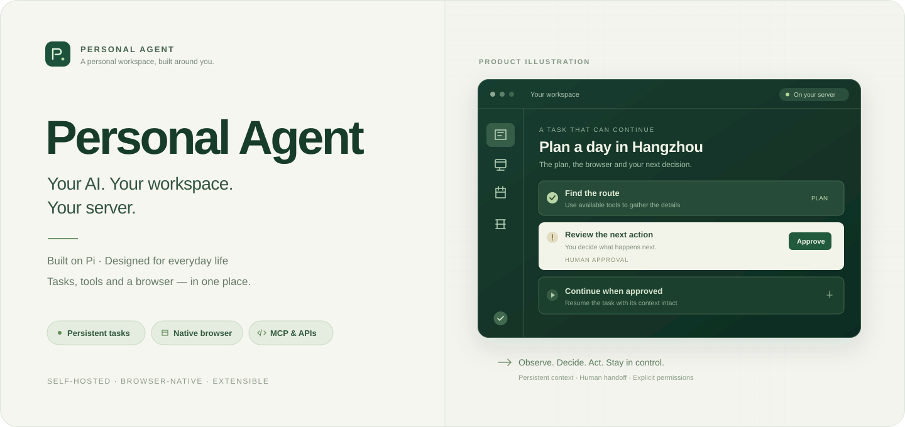
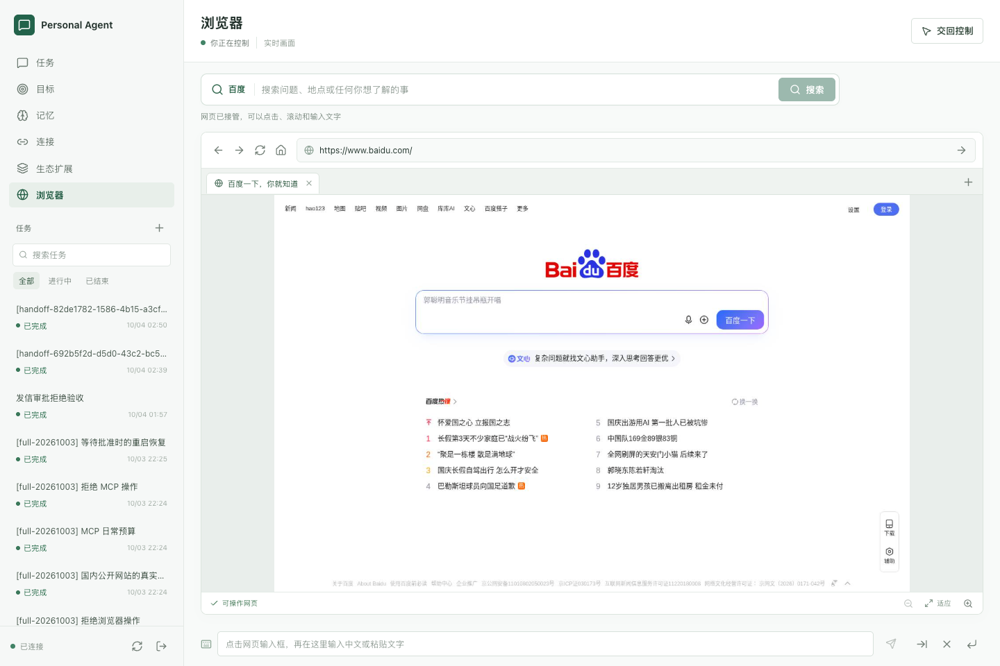
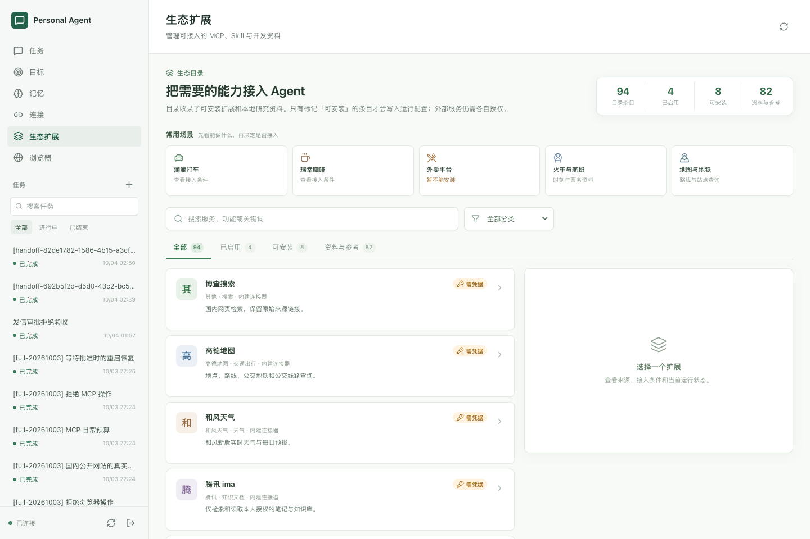
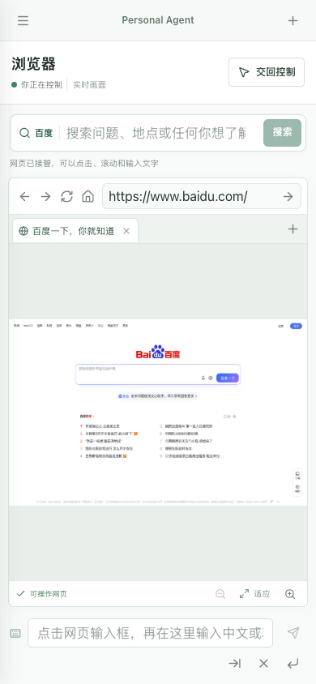
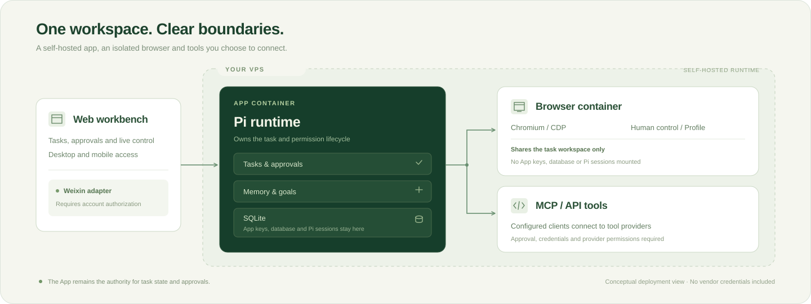

<p align="center">
  
</p>

<h1 align="center">Personal Agent</h1>

<p align="center">
  <strong>让个人 AI 拥有自己的工作台、浏览器和长期记忆。</strong><br />
  为独立 VPS 与国内生态设计的个人 Agent，基于 Pi 构建。
</p>

<p align="center">
  <a href="#快速开始">快速开始</a> ·
  <a href="#界面预览">界面预览</a> ·
  <a href="#产品能力">产品能力</a> ·
  <a href="#技术架构">技术架构</a> ·
  <a href="#生态与扩展">生态与扩展</a> ·
  <a href="#常见问题">常见问题</a>
</p>

---

**Personal Agent 是一个基于 Pi 的自托管个人 AI 助手。** 它将网页工作台、持久后台任务、个人记忆、定时目标、可人工接管的 Chromium 浏览器和 MCP/API 工具放在同一套系统中，面向希望在自己的服务器上运行 Agent、连接国内服务、并保留操作控制权的个人开发者。

*Personal Agent is a self-hosted personal AI assistant built on Pi. It combines persistent tasks, editable memory, scheduled goals, native browser collaboration, and MCP/API tools in a TypeScript application designed for VPS deployment and Chinese ecosystem integration.*

| 任务连续性 | 人与 AI 协作 | 国内生态开发 |
| :--- | :--- | :--- |
| 独立会话、后台执行、暂停与恢复 | 实时网页、人工接管、明确审批 | 查询连接器、受控 MCP、固定源码快照 |

## 界面预览

### 在同一个浏览器里，把控制权交给合适的一方

<p>
  
</p>

工作台显示真实 Chromium 页面。默认打开百度，支持直接搜索、地址导航、标签切换与中文输入；需要登录或人工处理时接管当前浏览器，完成后交回 Agent 重新观察。

<table>
  <tr>
    <td width="74%" valign="top">
      <strong>生态扩展：先了解能力，再决定接入</strong><br /><br />
      
    </td>
    <td width="26%" valign="top">
      <strong>手机上的浏览器协作</strong><br /><br />
      
    </td>
  </tr>
</table>

<sub>以上为实际 VPS 工作台截图，侧栏任务为验收记录；手机截图使用 390px 模拟视口。它们展示当前界面，不代表所有第三方账号已授权。</sub>

## 产品能力

### 一套个人工作台，承接完整任务

| 能力 | 你可以做什么 | 当前实现 |
| :--- | :--- | :--- |
| **持久后台任务** | 提交任务、追加消息、引导执行、暂停、取消和恢复 | 每个任务独立 Pi 会话；消息、操作、状态和成果持久化；网页关闭不取消任务 |
| **原生浏览器协作** | 查看实时网页，在 AI 与人工操作之间交接 | Chromium / CDP、AX/DOM 观察、截图流、多标签、中文输入、弹窗决策与断线恢复 |
| **可编辑个人记忆** | 保存偏好与事实，查看来源，纠错或删除 | 显式文本记忆、来源与版本管理、关键字检索；每次执行加载当前有效记录 |
| **定时目标** | 让同一个任务按计划执行 | 单次、每日、固定间隔，支持启停与最大运行次数；每日计划采用 Asia/Shanghai |
| **成果与操作记录** | 查看用了哪些工具，下载生成的结果 | 流式回复、脱敏工具记录、Markdown 等文件成果与下载 |
| **模型与工具配置** | 使用自己的模型服务，连接查询 API 与 MCP | Pi SDK、自定义兼容 API、stdio / Streamable HTTP MCP、本实例独立配置 |
| **明确的人工审批** | 核对具体操作，再批准或拒绝 | 审批绑定完整参数、哈希与版本；浏览器代码、MCP 调用及每封邮件有各自审批边界 |
| **生态扩展管理** | 浏览能力、配置凭据、安装和卸载受支持的适配器 | 94 条目录，白名单安装；归档源码不会因点击安装而直接运行 |

### 从一句需求，到一个可核对的结果

1. **提出需求。** 在网页工作台创建任务，并按需要补充上下文。
2. **规划与调用。** Pi 根据任务、当前记忆和可用工具执行；查询结果保留来源与时间。
3. **在需要时确认。** 对待批准的操作核对参数；需要人工处理网页时接管浏览器。
4. **继续同一任务。** 交回后重新观察当前页面；追加指令或恢复时延续原 Pi 会话。
5. **查看结果。** 在消息、操作和成果面板核对结果，下载生成的文件。

可以从这些具体需求开始：

```text
查询杭州的天气，标明数据来源和查询时间，整理成一份出行建议。

根据我提供的资料生成 Markdown 总结，并保存为可下载的文件。

记住我更喜欢简洁的中文回复；之后我可以在记忆页面修改或删除。

打开我指定的网页，先读取页面信息，需要执行操作时让我核对批准。
```

后台目前使用单 worker 串行执行。服务重启后的在途任务会暂停，核对后再恢复，避免自动重放尚未确认的外部动作。

## 快速开始

### 本地运行

需要 **Node.js `>=24.15.0 <25`**。使用浏览器功能时，本机还需安装 Chrome 或 Chromium；也可以通过 `BROWSER_EXECUTABLE_PATH` 指定可执行文件。

```sh
git clone https://github.com/Jane-o-O-o-O/personal-agent.git
cd personal-agent

npm ci
npm run build
npm start
```

打开 **[http://127.0.0.1:3420](http://127.0.0.1:3420)**，完成以下配置：

1. 从本机 `data/admin-password` 读取首次启动生成的访问密码，登录工作台。
2. 在「连接」中设置模型服务、API 地址、模型名称和 Key，并测试连接。
3. 按需求配置查询接口或 MCP；在「生态扩展」中查看真实接入条件。
4. 创建第一个任务，在「操作」与「成果」中检查执行结果。

首次启动同时生成 `data/master-key`，用于解密已保存配置。真实环境变量、运行数据和密钥已排除在 Git 之外；备份时应同时保留数据与原加密 key。

> 当前仓库为私有，克隆需要仓库访问权限。这里没有预置个人模型 Key、公开演示密码或已授权的第三方账号。

### 开发模式

```sh
# 服务端开发与自动重启
npm run dev

# 在另一个终端启动前端热更新
npm run dev:web
```

运行配置模板见 [`.env.example`](.env.example)，正式部署步骤见 [VPS 部署说明](deploy/README.md)。

### 部署到独立 VPS

应用与浏览器使用两个容器，适合常驻运行。准备 `.env`、持久化目录、权限和反向代理后，在项目根目录启动：

```sh
docker compose --env-file .env -f deploy/compose.yaml up -d --build
```

| 持久化目录 | 内容 |
| :--- | :--- |
| `state/app` | 任务、记忆、目标、加密设置与 Pi 会话 |
| `state/browser` | Chromium profile 与浏览器登录状态 |
| `state/workspaces` | 任务工作区与生成的成果 |

Docker 浏览器镜像安装 Chromium。公网 HTTPS、证书与 `PUBLIC_ORIGIN` 需要按自己的服务器配置；CDP 和内部浏览器服务不直接暴露到公网。完整的密钥、沙箱、备份与恢复步骤见 [部署文档](deploy/README.md)。

## 技术架构

<p>
  
</p>

**Pi 是唯一的规划与工具循环。** 项目在 SDK 之上实现任务状态、审批、个人记忆、定时目标、消息渠道和工作台；浏览器执行层负责操作 Chromium。

| 层级 | 技术与职责 |
| :--- | :--- |
| Agent 运行时 | Pi SDK 1.0、持久会话、上下文管理、工具调用与扩展 |
| 应用服务 | Node 24、TypeScript、Fastify 5、SQLite WAL、事务与 SSE 事件重放 |
| 网页工作台 | React 19、Vite 8、任务与资源界面、原生浏览器协作 |
| 浏览器执行 | 固定版本 Browser Use Pi 执行模块、Chromium、CDP、AX/DOM、实时画面 |
| 工具与渠道 | Pi 官方 MCP 扩展、HTTP 查询适配器、微信协议适配器、Resend 发信 |
| 部署 | Docker、独立应用/浏览器容器、HTTPS 反向代理、持久化 profile |

应用凭据、数据库和 Pi 会话留在应用侧。浏览器容器仅共享任务工作区；任务状态与控制版本在交接时核对，旧输入和旧画面被拒绝。MCP 使用本实例配置，默认 coding/shell 工具关闭。

进一步阅读：[实施架构](docs/implementation-architecture.md) · [浏览器实现](src/server/browser/README.md) · [浏览器优化与选型](docs/browser-workspace-optimization.md) · [开发计划](docs/development-plan.md)。

## 生态与扩展

### 为国内日常场景准备可开发的接入路径

生态目录目前有 **94 条**：**78 份归档资产 + 12 个可安装适配器 + 4 个参考项**。目录保留来源、固定版本、账号条件和能力限制，便于后续开发与二次适配。

| 场景 | 接入路径 | 当前边界 |
| :--- | :--- | :--- |
| 搜索、地点与交通 | 博查搜索、高德地点/路线/公交地铁 | 已实现适配器，需对应凭据与配额 |
| 天气、日历与汇率 | 和风天气、中国日历、公共天气、参考汇率 | 国内天气需凭据；公共数据标明来源和时间 |
| 个人知识 | 腾讯 ima 只读知识检索 | 需自己的平台凭据与知识范围授权 |
| 通用工具 | stdio / Streamable HTTP MCP | 本实例管理员配置；调用受审批约束 |
| 微信消息 | 基于腾讯 OpenClaw Weixin 公开协议的独立适配器 | 协议实现已完成；本人扫码与真实消息联调仍待验收 |
| 邮件 | Resend 单收件人纯文本发信 | 逐封核对批准；尚未验证真实投递，QQ/Gmail 收信未实现 |
| 出行与票务 | 滴滴查询沙箱、瑞幸自提查询、飞常准查询的受控 MCP | 已有适配路径，需厂商凭据；未完成真实账号业务联调 |
| 普通外卖与办公 | 美团外卖、淘宝闪购、京东外卖、WPS 365 的接入资料 | 外卖个人下单接口未核实；WPS 365 需企业授权，不标记为已连接 |

**归档、安装和真实业务授权是不同状态。** 安装白名单适配器后仍需凭据、连接探测与业务权限；卸载移除本实例配置，不替代平台侧撤销授权或取消订单。当前没有开放真实支付、自动叫车或外卖下单。

资源入口：[生态资产索引](resources/ecosystem/INDEX.md) · [生态管理页说明](docs/ecosystem-manager.md) · [日常查询接口](docs/daily-query-apis.md) · [可开发能力清单](docs/development-scope.md)。

## 开发与验证

截至 **2026-10-04**，最新冻结版本的验证结果如下：

| 验证层级 | 已通过 | 范围 |
| :--- | :--- | :--- |
| 单元与服务集成 | **138 项** | Pi、任务、审批、认证、记忆、调度、连接器及真实 Chromium 回归 |
| 网页端到端 | **18 项** | 工作台、生态管理、浏览器协议和桌面/手机布局 |
| 公网浏览器与 Pi 交接 | **30 项** | 8 项工作区、17 项原生交互、2 项真实 Pi 交接、3 项补充边界 |

这些数值对应报告中列出的场景，不能扩展为任意任务成功率、所有国内账号已接通或支付流程已验收。真实 iOS、长期压力、跨进程 iframe 全面适配、人工拖拽与完整验证码处理尚未验收或实现。

```sh
npm run typecheck
npm test
npm run build

# E2E 需运行中的测试实例和 Chrome
npm run test:e2e
```

E2E 可通过 `AGENT_E2E_URL`、`AGENT_E2E_PASSWORD` 或 `AGENT_E2E_PASSWORD_FILE` 指定测试目标；请使用独立 `DATA_DIR`，让测试数据与个人实例分开。

详细证据：[全量功能测试报告](docs/full-functional-test-report.md) · [浏览器验收与已知限制](docs/browser-workspace-optimization.md) · [首版验收记录](docs/verification-report.md)。

## 常见问题

### Personal Agent 适合谁？

适合希望在自己的 VPS 上运行个人 AI、控制模型和数据、扩展 MCP/API，并愿意配置第三方服务凭据的个人开发者。当前按单个个人实例设计，不是多租户 SaaS 或已经接通所有生活服务的成品。

### 可以使用自己的模型 API 吗？

可以。在「连接」中配置模型服务，支持自定义兼容 API 与模型名称。图像输入等能力需要对实际端点测试后启用，不能仅凭模型名称推断。配置读取不会回填明文 Key。

### 浏览器是否支持人工接管？

支持。工作台展示原生 Chromium 实时画面；接管会先停止 Agent 当前执行并暂停任务，再允许人工操作。交回后重新观察当前页面，恢复时延续同一 Pi 会话。现有输入包含点击、移动、滚动、文本与键盘；人工滑块拖拽尚未实现。

### 网页关闭后，任务还会运行吗？

会，网页只是任务入口与观察界面，执行发生在服务端。服务进程需要保持运行；如果服务器重启，在途任务会暂停等待核对，不会自动重放外部操作。

### 长期记忆是向量数据库吗？

目前不是。项目使用 SQLite 保存可查看、可编辑、可删除的显式文本记忆，检索采用关键字匹配。向量语义检索尚未实现；已有存储与版本管理可以作为后续扩展基础。

### 国内服务是否已经全部接通？

没有。项目区分已实现适配器、待凭据连接、第三方代码归档和参考资料。微信需要本人授权；滴滴、瑞幸和票务查询需要厂商凭据；普通外卖下单、真实支付和 QQ/Gmail 收件仍不属于当前已接通能力。

### 为什么选择 Pi？

Pi 提供可嵌入的 TypeScript SDK、会话、上下文管理、工具与扩展机制，适合在现有服务中构建个人 Agent。本项目复用其规划循环，把产品侧的任务、审批、浏览器和渠道管理留在自己的应用中。具体取舍见 [Pi 与产品方案](docs/muse-and-pi.md)。

## 项目结构

```text
personal-agent/
├── src/client/          # React 工作台、聊天、生态与浏览器面板
├── src/server/          # Pi 运行时、任务、认证、记忆、目标、工具与渠道
├── src/shared/          # 前后端共享契约
├── vendor/browser-use/  # 适配后的固定版本浏览器执行模块
├── resources/ecosystem/ # 固定版本生态快照、来源索引与校验信息
├── tests/               # 服务集成与网页端到端测试
├── scripts/             # 资产同步、依赖检查、部署与验证
├── deploy/              # Docker、反向代理与 Chromium 沙箱配置
└── docs/                # 架构、开发范围、接入设计、研究与验收
```

## 文档与来源

| 你想了解 | 阅读入口 |
| :--- | :--- |
| 当前范围与后续开发 | [开发计划](docs/development-plan.md)、[可开发能力清单](docs/development-scope.md) |
| 安装、VPS 与备份 | [部署说明](deploy/README.md)、[配置模板](.env.example) |
| 国内 API 与生态资产 | [日常查询](docs/daily-query-apis.md)、[国内生态调研](docs/domestic-ecosystem.md)、[资源索引](resources/ecosystem/INDEX.md) |
| 浏览器效果、接管与限制 | [浏览器实现](src/server/browser/README.md)、[优化记录](docs/browser-workspace-optimization.md) |
| 微信与邮件 | [微信接入](docs/weixin-channel.md)、[邮件集成](docs/mail-integration.md) |
| 实际验证结果 | [全量报告](docs/full-functional-test-report.md)、[首版记录](docs/verification-report.md) |

项目使用 [Pi](https://github.com/earendil-works/pi) SDK，浏览器执行模块基于 [Browser Use Pi](https://github.com/browser-use/browser-use-pi)，微信适配参考 [腾讯 OpenClaw Weixin](https://github.com/Tencent/openclaw-weixin) 的公开协议。第三方快照保留各自来源与许可，见 [资源索引](resources/ecosystem/INDEX.md) 和 [Browser Use NOTICE](vendor/browser-use/NOTICE.md)；项目整体分发许可证尚未单独指定。

维护者：[Jane-o-O-o-O](https://github.com/Jane-o-O-o-O)。项目名称、能力描述、配置步骤与验收范围以本仓库文档为准。
