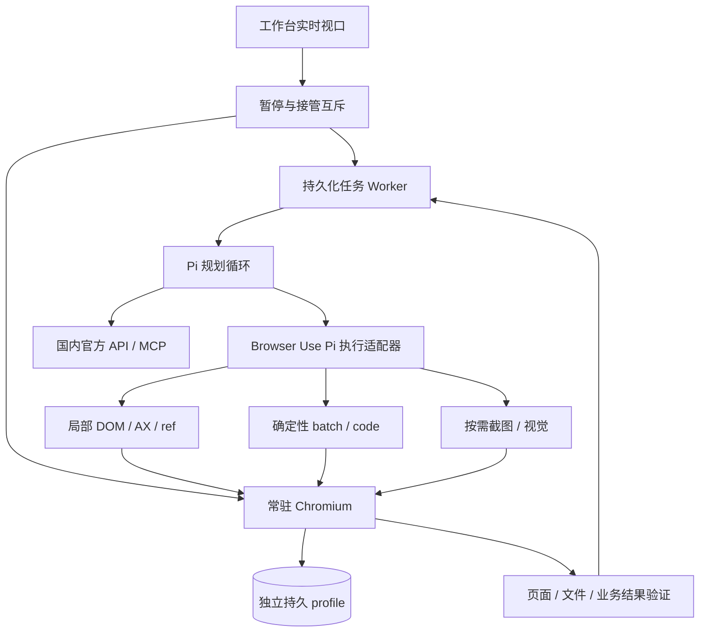

# 浏览器控制调研与 Pi/VPS 选型

核验日期：2026-10-02。研究对象为 Meta 的个人 Agent Muse，以及可供本项目参考的开放浏览器执行器。资料来自第一方公告、公开搜索、官方仓库固定提交、npm/PyPI 发布内容和评测报告；本轮没有登录 Muse、运行候选执行器或测量本项目任务速度。

选型更新：2026-10-03。按 Pi、独立 VPS、国内生态及方便二次开发的要求，选定 **Browser Use Pi 的 TypeScript 浏览器执行层** 作为开发底座。当天重新核对固定源码的 package、API、浏览器原语、会话文档和 MIT 许可证；运行兼容与性能尚未实测。

## 结论

1. **本轮取得的 Muse 第一方正文没有披露浏览器控制协议。** 可以确认专属云端计算机、打开浏览器、填写表格及连接器能力；无法确认其使用 CDP、Playwright、DOM、可访问性树或截图坐标的具体组合。
2. **已有成熟的结构化浏览器路线可供实现。** 读取 DOM/可访问性树，定位实际元素，再通过浏览器协议输入；截图可按需使用。这些机制有开源代码支撑，无需假设它们就是 Muse 的实现。
3. **本项目选择 Browser Use Pi 的浏览器执行层，保留 Pi 统一规划。** 复用持久代码执行、CDP、AX/DOM、profile 和按需截图，外层实现国内工具、任务、取消及接管。这个选择依据技术栈、可改造范围和自托管能力；性能仍按同环境完成率、耗时和接管率验收。

详细核查记录：[Muse 第一方证据](research-muse-browser.md)、[TypeScript/CLI 方案](research-browser-tools-ts.md)、[Browser Use/Skyvern 方案](research-browser-tools-python.md)。

## Muse：确认了什么

| 问题 | 核实结果 | 依据与限制 |
| --- | --- | --- |
| 在哪里运行 | 专属云端计算机 / Secure VM | [9 月 8 日官方公告](https://about.fb.com/news/2026/09/introducing-muse-personal-ai-agent/)；没有具体浏览器或虚拟化配置 |
| 能否操作网页 | 可以打开浏览器、填写表格及代表用户处理事务 | 原文 `It can open a browser, fill out forms, and negotiate on their behalf.`；没有控制接口说明 |
| 是否所有工作都走浏览器 | 官方确认存在服务连接器和自定义连接器 | [Connect 综述](https://about.fb.com/news/2026/09/the-biggest-news-from-connect-2026/)、[小企业公告](https://about.fb.com/news/2026/09/introducing-muse-small-business/)；具体任务执行路径未知 |
| 使用什么模型 | Muse Spark | 公告提供模型名称；初始模型的速度定位不能直接换算浏览器任务耗时 |
| 是否是 OpenClaw / Playwright / CDP | 未确认 | 没有取得能支持这些归属的一手技术正文 |
| 为什么观感很快 | 无法分配具体原因或比例 | 没有可比的真实任务轨迹、逐动作延迟或同条件基准；演示片段不是性能测量 |

另行读取了 4 月模型公告、7 月行动能力公告、Muse Platform 和支持页，并检索 Meta 工程站与公开 GitHub 组织。Bing 实际网页搜索补充了第三方项目；Google 等部分搜索入口及 Meta 的研究、安全、帮助页面访问超时。以上只支持“本轮取得的正文未披露”，不支持“Meta 从未公开过”。失败地址与访问方法保留在第一方证据文件中。

两个容易误认的搜索结果：

- `www222fff/muse2api` 用 CDP 控制 **Muse 聊天网页**，包装消息收发；这与 Muse 自己访问其他网站的浏览器是不同层。README 还说明没有真实账号测试。
- `javedhamzabwn/browser-bridge-for-muse` 是第三方外接网关，README 面向 OpenMuse 等 Agent；它使用 Playwright 的事实不能证明 Meta Muse 使用 Playwright。

## 结构化控制为什么能减少开销

浏览器自动化需要区分观察、决策、执行和等待四个环节。

**观察：** DOM 包含网页节点、属性和文本；可访问性树 AX 提供按钮、输入框等角色、名称与状态。工具可以把页面整理成紧凑信息，并给目标绑定 ref 或浏览器节点 ID。Playwright 的 ARIA 快照由 DOM 计算，agent-browser 则读取 Chrome 原生 AX，两者的内部机制有区别。

**决策：** Pi 根据已观察到的字段和状态生成动作或一段代码。例如同一个已知表单的多个输入可以在一轮决策后连续填写；新的页面、错误或未知分支仍需重新观察。

**执行：** CDP 是 Chrome DevTools Protocol，可以读取页面结构、执行网页 JavaScript、获取元素位置及发送鼠标键盘事件。Playwright 还提供 Locator 和可操作性等待。CDP 是协议，并不自行完成任务规划或保证结果正确。

**等待与校验：** 等待目标按钮可用、搜索列表出现或业务状态改变，再验证真正的任务结果。网络静默只能作为辅助，页面没有网络请求也不代表订单或下载已完成。

坐标输入本身不等于图像识别。agent-browser、Browser Use Pi 等可以通过已定位 DOM 节点计算点击位置，再发真实鼠标事件；模型不需要先从截图猜这个按钮在哪里。相反，Canvas、图形编辑器、没有语义信息的控件等仍可能需要视觉定位。用户工作台的视频画面与模型的观察输入也是两条通路：显示实时浏览器，并不意味着每帧都交给模型推理。

协议参考：[CDP Accessibility](https://chromedevtools.github.io/devtools-protocol/tot/Accessibility/)、[CDP Input](https://chromedevtools.github.io/devtools-protocol/tot/Input/)。

端到端耗时可以拆成：

```text
总耗时 = 启动与登录
       + 各轮模型推理、工具传输、浏览器执行、页面/业务等待
       + 重试与人工接管
```

| 优化点 | 可采用的做法 | 需要同时验证 |
| --- | --- | --- |
| 模型输入 | 局部/紧凑/差异快照，按需读取正文和截图 | 页面信息是否足够，是否遗漏状态 |
| 决策粒度 | 已知步骤用 batch/code 一次执行多个动作 | 导航或重绘后是否停止使用旧 ref |
| 输入动作 | 批量填文本、复用 CDP 连接和浏览器进程 | 站点是否需要键盘、change 等事件 |
| 等待 | 可见性、元素、URL、文本、业务条件等待 | 慢加载时能否正确完成，而非提前返回 |
| 重复流程 | 保存经验证的工作流，失效后重新观察 | 登录态、页面版本、参数及最终结果 |
| 启动/登录 | 常驻 session 和独立持久 profile | 冷启动、会话过期和重启恢复 |
| 服务查询 | 已开放且获权的官方 API/MCP | 数据范围、时效和账号权限 |

这些是可测试的工程方向，不能据此推断 Muse 的各项实现。

## 候选项目

以下版本已核对发布包或固定源码；更多源码定位、许可和等待行为见两个项目核验文件。

| 项目 | 已核实的控制方式 | 对本项目的价值 | 接入边界 |
| --- | --- | --- | --- |
| [agent-browser 0.38.2](https://github.com/vercel-labs/agent-browser/tree/39a74c70d7759d5a6de7a22c04570bb626bbd081) | Rust 常驻 daemon、直接 CDP、AX/ref、紧凑/差异快照、JSON batch、按需截图 | 独立于 Pi 包版本的自托管执行器；已有 profile、视口流和输入接管 | Apache-2.0；npm 要求 Node >=24；batch 内仍逐条执行；iframe/ref 等需实际验证 |
| [Browser Use Pi](https://github.com/browser-use/browser-use-pi/tree/f1f763667303f08e9a2532c89304522da67996e5) | Pi + 常驻 Node/V8 REPL + CDP；AX/DOM、代码多动作及截图 | 与我们的 Pi 核心方向直接匹配，可参考可取消 worker 和浏览器原语 | MIT；main 依赖 Pi 0.87.1，npm 0.1.0 依赖 0.85.1；与本项目 Pi 1.0.0 尚未兼容测试 |
| [BrowserCode v0.1.20](https://github.com/browser-use/browsercode/tree/e63409939d7dbc3e3d053cc3b36bd3fd81b8154e) | OpenCode fork + TypeScript Browser Harness；持久 JavaScript 工具经 CDP 控制 Chrome | 有当前长任务榜单记录，可参考 browser_execute(code) 和状态复用 | MIT；属于独立代码线，成绩不能归给 Browser Use Pi；该评测使用 Browser Use Cloud Chrome |
| [Stagehand 4.1.0 / Pi](https://github.com/browserbase/stagehand/tree/cd7b230778cf92269e4cb90e80d97f5113781c51/packages/integrations/pi) | 浏览器扩展 runtime、DOM+AX、CDP；Pi 的 run/snapshot/screenshot | 官方 Pi 直接工具示例、浏览器侧批量执行、确定性操作 | MIT；Pi 集成实验性且从源码提供；Browserbase 云缓存不在本地生效 |
| [Playwright MCP 0.0.83](https://github.com/microsoft/playwright-mcp/tree/f183dad4a52965583e3cc1d59b88cdc279e2e57d) | DOM 派生 ARIA/ref + Locator；多字段表单及代码工具 | 等待与浏览器能力成熟，适合作为可靠性基线 | Apache-2.0；当前额外 settle 默认 500 ms；通用代码工具在服务进程执行，需专用执行环境 |
| [Playwright CLI 0.1.22](https://github.com/microsoft/playwright-cli/tree/b85c7a736bb473bf55b584e54a09ffa698d6d871) | 与 MCP 共享 backend；daemon、按需快照文件、代码与录制 | 少量工具入口，已有 show 监控与接管 dashboard | Apache-2.0；按需读取文件未必减少模型轮数；跨重启需持久 profile |
| [Browser Harness JS](https://github.com/browser-use/browser-harness-js/tree/2d9a5ed37ed11f31b2622cd69c4b55f979cb905f) | Bun 常驻 REPL、原始 CDP typed wrappers | 轻执行层参考，不强制增加模型循环 | MIT；高层动作、取消、超时和隔离需要补充 |
| [Browser Use Python](https://github.com/browser-use/browser-use/tree/302d8fcb245a7a63fb7531a4734c9ce3c7792779) / [Skyvern](https://github.com/Skyvern-AI/skyvern/tree/e0aade09cbb341a9fa49442d744c8017e4a01dc7) | 结构化浏览器工具和视觉补充；均有直接动作与 AI 任务入口 | 复杂流程、失败恢复和公开效果评测参考 | Browser Use 为 MIT，Skyvern 核心为 AGPL-3.0；云服务的反机器人等能力不能等同于自托管核心 |

Playwright MCP/CLI 的实现已迁到 monorepo；上述包固定依赖对应 [Playwright 提交](https://github.com/microsoft/playwright/tree/e8149b8257d32dcf8f72573ecc43e72439da7080/packages/playwright-core/src/tools)。不能沿用早期仓库结构或工具名称推断当前功能。

Browser Use Pi 的 main 有 `ultrafast`、`Browser.pending()` 等，而 npm 0.1.0 没有这些接口。其 main 的状态等待使用 80 ms 安静窗口、一般 800 ms 上限，加载中再延长；这是启发式状态观察，不是业务完成保证。Stagehand 直接 Pi 工具不再调用 Stagehand 模型，其自然语言 `act/observe/extract` 则需要额外推理。Pi 外层调用 Browser Use/Skyvern 的完整 Agent 任务也属于委派，成本统计要包含内部模型调用。

本项目 Pi v1.0.0 已有官方 MCP 扩展，支持 stdio 和 Streamable HTTP。Stagehand 集成文档中的旧说明不能用于断言本项目无法使用 MCP；直接扩展与 MCP 是两种可用接法。

## OpenClaw 的补充参考

读取官方文档固定提交 [3932cbe4c91c5f3838a141f6a8cdeeb48fdf50b6](https://github.com/openclaw/openclaw/tree/3932cbe4c91c5f3838a141f6a8cdeeb48fdf50b6/docs/tools/browser)。该版本区分三种 profile：

- `openclaw`：专用受控浏览器和独立登录目录；文档记录 Playwright-backed 操作、页面快照/ref 和按需截图。
- `user`：通过 Chrome DevTools MCP 附着现有个人 Chrome，首次需要用户在电脑上处理调试授权。
- `chrome`：通过 Chrome 扩展使用现有已登录会话，适用条件与 `user` 不同。

[Agent tools](https://github.com/openclaw/openclaw/blob/3932cbe4c91c5f3838a141f6a8cdeeb48fdf50b6/docs/tools/browser/agent-tools.md) 明确记录单个 browser 工具、结构化快照/ref、batch、导航返回新状态及旧 ref 恢复。[Profiles](https://github.com/openclaw/openclaw/blob/3932cbe4c91c5f3838a141f6a8cdeeb48fdf50b6/docs/tools/browser/profiles.md) 描述工作台视口流和截图回退。[Remote](https://github.com/openclaw/openclaw/blob/3932cbe4c91c5f3838a141f6a8cdeeb48fdf50b6/docs/tools/browser/remote.md) 说明远程 node/CDP 与本地浏览器的路由和所有权。

值得参考的是 profile、稳定 tab、失效 ref 恢复、远程浏览器路由和工作台设计。本项目无需为了使用这些设计而改变 Pi 核心；也不能把 OpenClaw 的文档当作 Muse 内部架构证据。

## 公开效果证据

### Skyvern 最新生产报告及榜单

[2026-10-01 官方文章](https://www.skyvern.com/blog/deleting-rag-from-our-web-agent-made-it-2-3x-faster/) 描述受 Pi 启发的浏览器 Agent 重写，并报告约 100,000 次生产 A/B 运行：

| 指标 | 原架构 | 新架构 |
| --- | --- | --- |
| 平均任务耗时 | 593 秒 | 262 秒 |
| 作者统计的平均成本 | $0.039 | $0.0302 |
| 含截图的 LLM 调用占比（作者口径） | 27% | 2.7% |
| 平均模型调用次数 | 6.4 | 23 |
| 每次模型调用平均 token 用量 | 约 29K tokens | 约 12K tokens |

作者给出的提速约 2.3 倍。减少大规模预处理、让 Agent 按需读取页面、使用小工具及变化后重新观察，值得参考；模型调用次数增加而耗时下降，也说明“更少调用”不能单独解释速度。截图比例的分母也随 LLM 调用数变化，不能将 27% → 2.7% 等同于每任务截图张数减少 90%。

该报告未披露模型及推理档位、流量分组、任务分布、失败/超时计入方法、重试和成本范围、P95 或误差区间及源码 SHA。它属于作者生产统计；我们没有取得原始生产任务并独立复测，不能把其提速倍数套到 Muse、国内模型或我们的 VPS。

[Odysseys 官方榜单](https://odysseysbench.com/leaderboard.html) 的 [数据及条件](https://odysseysbench.com/js/data.js) 已收录 Skyvern：200 个提交轨迹，Claude Opus 5、xhigh、100-step budget，截图与结构化工具混合；官方 per-rubric judge 的完整成功率 **90.5%**、rubric average **98.12%**、平均 **65.38 steps**。没有报告 O-M2W holistic judge 分数。该成绩支持特定模型与执行系统组合的效果，不能单独归功于浏览器协议。

这条榜单记录没有给出确切源码版本、执行日期、执行重试/judge 次数及原始轨迹链接；不能自动归给某个开源发布包或自托管配置。

### 其他报告的使用边界

同一 Odysseys 榜单还收录 **BrowserCode 86.0%** 完整成功率、约 96.82% rubric 微平均和 124.205 平均步数。条件为 bcode v0.1.20、GPT-5.6 Luna xhigh、Cloud Chrome、JS/CDP、全部 200 个任务及 1,225 条 rubric；成绩为三次独立 judge 评分的均值，不能解释为三次执行重试。没有取得该提交的原始公开轨迹，执行重试条件仍未知。

[固定 README](https://github.com/browser-use/browsercode/blob/e63409939d7dbc3e3d053cc3b36bd3fd81b8154e/README.md) 明确 BrowserCode 基于 OpenCode；它与 Browser Use Pi 是两个项目。[CDP 层来源记录](https://github.com/browser-use/browsercode/blob/e63409939d7dbc3e3d053cc3b36bd3fd81b8154e/packages/bcode-browser/src/cdp/PROVENANCE.md) 说明其 Browser Harness 移植来源。该分数支持代码驱动路线值得评估，不能用于声称 Pi 已达到 86%，也不能与不同模型下 Skyvern 的成绩直接比较浏览器执行器。它的 step 为模型工具调用轮数加最终回复，不等于鼠标动作数，不能用平均 steps 推断实际耗时。

| 证据 | 可得出的判断 | 不能外推的结论 |
| --- | --- | --- |
| Browser Use Pi 历史 91/106，重复为 79/85/84 | 历史候选有运行记录，也有明显波动 | 当前源码稳定达到 91/106；官方明确这些不是当前候选成绩 |
| agent-browser Rust daemon benchmark | 冷启动和内存是重要收益方向 | Rust 会让所有点击或任务快很多；官方说明单命令延迟主要由 Chrome/CDP 决定 |
| Stagehand main 的云浏览器 2x 宣称 | 可作为云端执行架构的线索 | 稳定 4.1.0 的本地 VPS 自动快 2 倍，或本地拥有云缓存 |
| Playwright CLI 更紧凑的工具入口 | 可减少工具 schema 和强制页面内容输入 | 一定比 MCP 快；额外读文件也可能增加一次模型往返 |

本轮没有获得这些固定源码在同模型、同任务、同浏览器、同网络和同预算下的统一排名；尚无国内个人日常工作流的实测数据。不同评测的任务、judge、模型和 step 定义不同，不能把百分比排成执行器排行榜。

## 本项目建议

### 首版实现路线

采用 **Pi v1.0.0 + Browser Use Pi 浏览器执行层 + VPS Chromium + 持久 profile + 工作台接管**。选择具体仓库 [browser-use/browser-use-pi](https://github.com/browser-use/browser-use-pi)，开发参考固定源码 `f1f763667303f08e9a2532c89304522da67996e5`。保留 Playwright 作为可靠性和性能对照，不在同一任务中混用两套元素状态。

选择理由：

1. 核心是 TypeScript，与 Pi 和项目后端同技术栈；固定提交 `src/` 有 25 个文件、约 234 KB，浏览器、CDP、AX、worker 和模型循环分开，源码改造范围相对集中。
2. 可控制 VPS 本地 Chromium，也可连接现有 Chrome/CDP；自托管执行不要求 Browser Use Cloud。观察以 AX/DOM 为主，真实浏览器输入及视觉补充已有实现。
3. 持久 Node/V8 REPL 允许一段代码完成多个已知动作，并复用函数和状态，适合积累国内网站的操作 helper。导航、重绘或异常后仍需重新观察。
4. 对外已有 CDP/Page/Tabs 和 `execute()`，能在我们的 Pi 工具中复用确定性执行；国内 API/MCP、模型选择、调度和记忆留在项目外层。
5. MIT 许可允许修改、分发和商业使用，复用时保留版权与许可证。具体许可见 [固定 LICENSE](https://github.com/browser-use/browser-use-pi/blob/f1f763667303f08e9a2532c89304522da67996e5/LICENSE)。

agent-browser 适合直接接入现成 CLI/MCP 功能；其当前执行器以 Rust 为主，深入修改执行层需要维护另一技术栈。Stagehand Pi 的浏览器扩展 runtime 和实验性 adapter 涉及更多组件。按本项目源码二创的权重，Browser Use Pi 更合适；这不等于已经实测其最快或在所有网站最可靠。

### 接入与改造边界

Pi 保持唯一规划循环，注册我们自己的浏览器代码工具，调用或适配 Browser Use Pi 的 `execute(code, { signal })`、worker 和浏览器原语。直接执行不会启动内部模型推理；`run()`/`followUp()` 会进入其内部 Pi 循环。源码对应 [index.ts](https://github.com/browser-use/browser-use-pi/blob/f1f763667303f08e9a2532c89304522da67996e5/src/index.ts) 与 [agent.ts](https://github.com/browser-use/browser-use-pi/blob/f1f763667303f08e9a2532c89304522da67996e5/src/agent.ts)。

SDK 的 `tools`、`beforeToolCall`、`afterToolCall`、`validateResult` 属于内部 Agent 路线。直接 `execute()` 不经过这些 hooks；国内工具注册、确认和结果校验由我们的 Pi 和执行适配器实现。

`pause()` 面向活动中的内部 Agent run，`cancel()` 中止其 run controller，不能据此宣称 standalone execute 已有完整暂停/接管。外层需要传递 AbortSignal、管理代码执行与人工输入互斥，并在中断后核对当前页面；已发出的浏览器副作用可能保留。

首批改造工作：

1. 固定上方源提交，统一到本项目 Pi v1.0.0 并验证工具、类型、事件与供应商接口。当前 main 依赖 Pi 0.87.1，npm 0.1.0 依赖 0.85.1，不能把 main 文档当作 npm 包的契约。
2. 实现浏览器执行适配器和统一外层取消、超时、结果校验；浏览器与执行器常驻，独立 profile 持久化。
3. 补工作台实时画面与同一 session 的人工接管、任务恢复。现有 pause/resume API 不等于现成网页接管产品；若复用 ultrafast，修改其自动接受 JavaScript confirm 的策略，并按我们的业务状态处理。
4. 增加中文表单、动态页面、下载、iframe、登录续接和重启恢复验收，记录模型、工具、等待和重试耗时。

复用层次与模块：`browser.ts` 管浏览器生命周期，`cdp.ts` 管协议连接，`page.ts` 提供页面原语，`ax.ts` 管结构化观察与快模式，`runtime.ts`/`worker.ts` 管持久代码执行，`agent.ts` 是内部规划循环。这个分层支持保留执行能力并接入我们的任务和渠道体系。



### VPS 与人工接管

浏览器与执行器尽量同机部署，保持本地 CDP 连接和独立持久目录。一个 profile 只由一个 browser owner 持有；同一会话的操作串行执行，独立只读任务需要并行时分配各自 tab/profile。没有评测前不根据用户数宣称某种 CPU/RAM 配置必然够用。

登录首次在该 VPS 的浏览器中完成。工作台显示同一个 session，可参考 agent-browser 的 WebSocket stream 或 Playwright CLI 的 show；必要时再采用 Xvfb/noVNC 的完整桌面路线。网页画面与执行命令经过我们的认证入口，CDP 保留在本机/私网。

接管流程为：任务暂停并释放动作执行权，用户在原 tab/profile 中处理登录或验证码，再交回控制；Agent 重新读取页面状态后继续。不要同时让人和 Agent 输入。VPS browser、profile、Pi 会话和任务数据库分别管理；保存 cookies 或聊天历史都不等于保存任意中断动作的执行状态。

重启或超时后，根据当前页面、文件和业务回执核对结果，再决定后续步骤。通用代码执行的 worker/Node VM 不能替代进程、文件和网络隔离；这是使用代码工具的部署要求。

### 国内生态覆盖

天气、地图、交通、搜索、航班、快递等优先走已开放且获权的 API/MCP。浏览器补充没有合适接口的网页查询、表单和资料处理，相关范围见 [日常查询清单](daily-query-apis.md) 与 [开发范围](development-scope.md)。

手机 App、微信小程序与网页不是同一个执行环境。某项服务只有唤端链接、扫码付款或专有 App 流程时，VPS 浏览器不能自动取得其完整操作能力。国内站点的登录验证、IP 条件和页面兼容性要在实际账户允许的工作流中验证；“支持 Chromium”并不等于支持所有国内业务。

## 以效果为准的验收

先做不调用模型的执行层比较，再做固定 Pi/模型的 Agent 比较。固定 Chromium 版本、CPU/RAM、网络出口、profile、viewport、模型推理档位和任务预算。冷启动/常驻、首次探索/已验证重放、结构化/允许视觉分别统计。

| 测试任务 | 成功的证据 |
| --- | --- |
| 中文多字段表单、下拉和勾选 | 页面或测试后台显示实际保存值 |
| 延迟出现/启用的按钮与慢搜索 | 点击发生在正确状态，查询结果完整 |
| SPA 重绘、失效 ref 与弹窗遮挡 | 正确重新观察，不点击错误节点 |
| 同源/跨域 iframe | 操作指定 frame 的正确字段 |
| 多标签页与文件下载 | 来源 tab、保存文件及文件内容符合任务 |
| 扫码登录后继续、人工接管 | 原 session 成功续接，执行所有权正确 |
| 超时、取消与进程重启 | 没有错误重复操作，最终结果可核对 |

执行层可在本地 fixture 预热后至少 20 次；Agent 层每项至少 10 次，保留失败案例和原始轨迹。真实国内网站以本人需要的只读查询和可撤销测试流程补充。

记录正确完成率、端到端 P50/P95、模型 tokens 与次数、浏览器命令数、截图数、等待耗时、重试和接管次数。成功需要检查最终结果，不能只判断工具是否返回 `success`。先要求正确完成率不下降，再比较耗时和成本；回放命中及人工登录时间单列。

本轮交付为证据与选型报告；浏览器执行器安装、版本兼容验证和本项目性能测试尚未开展。原有生态资源库仍为 78 项，新增浏览器项目以固定源码链接供后续评估，尚未归档或部署执行器。
