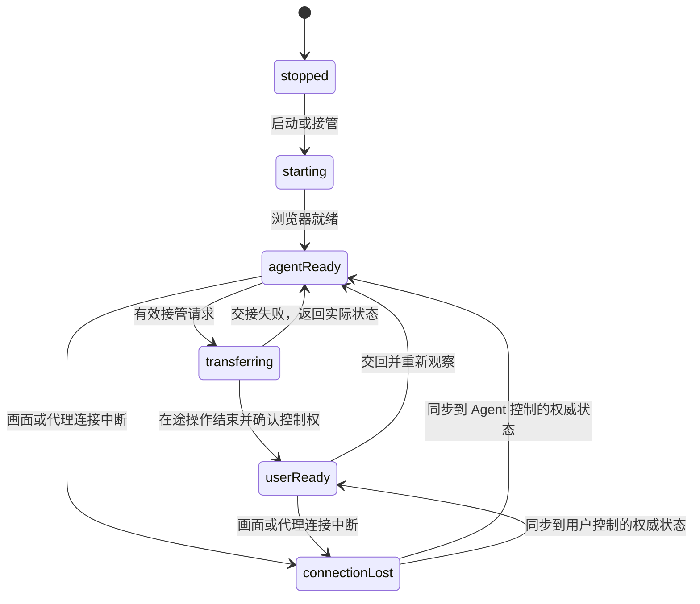

# 浏览器工作台优化方案与验收记录

调研与基线日期：2026-10-04（Asia/Shanghai）。范围：人工接管失败、默认百度页面、直接搜索、实时画面、浏览器导航与现有 Pi/CDP/VPS 适配。本文记录选型、已确认的问题机制，以及按运行阶段区分的测试与部署结果。

## 1. 本轮决策

保留当前 **Pi agent + browser-use-pi 执行器 + Chromium/CDP + VPS 浏览器侧车**。浏览器界面以 **Steel 开源 Viewer** 为代码参考，以 **Browserbase Live View 与人工参与模板** 为交互参考，在现有 React 工作台中实现。

这次优先处理接管事务、状态版本、画面连接和正常浏览器操作。基线时已启动浏览器可连续接管与交回，冷启动接管则存在可复现的版本冲突；本轮修复后两条路径均已验收。宿主的 ownership 与状态同步问题需要在现有架构中明确处理。

选型是针对当前单用户、自建 VPS、国内网站场景的工程判断。没有完成相同网络、网站和硬件条件下的跨项目性能测试，因此不声称某个产品绝对最快。

## 2. 参考案例与适配依据

| 项目 | 一手资料确认的能力 | 在本项目中的用途 |
| --- | --- | --- |
| Steel 开源 Viewer | 按 target 连接标签页，CDP screencast，键鼠输入，导航，心跳与清理 | 最接近现有 TypeScript/CDP 侧车，借鉴 viewer 的结构与操作协议 |
| Browserbase Live View | 交互与只读嵌入，每个 tab 独立 view，断连事件，移动端展示 | 借鉴明确的连接状态、tab 绑定和人工控制交互 |
| Browserbase + Stagehand 人工参与模板 | Agent 请求人工输入后暂停，前端提供输入后继续，SSE 活动记录 | 借鉴暂停、人工操作和同一任务继续的完整产品流程 |
| browser-use-pi | Pi 模型循环、持久 JS 会话、AX/DOM 观察、原始 CDP；profile 单 owner、每会话单操作 | 继续作为 Agent 的执行层，与现有任务及审批体系配合 |
| browser-use Web UI | Gradio 工作台、持久浏览器、Docker noVNC 查看入口 | 参考完整可运行案例；无需迁移现有 React/TypeScript 工作台 |
| noVNC / Apache Guacamole | 远程桌面连接、键鼠/触控、剪贴板、缩放与连接事件 | 未来原生桌面或文件选择窗口的可选备用通道 |

参考：[Steel 开源仓库](https://github.com/steel-dev/steel-browser)、[Browserbase Live View](https://docs.browserbase.com/platform/browser/observability/session-live-view)、[人工参与模板](https://dev.browserbase.com/templates/agent-with-human-in-loop)、[browser-use-pi 会话说明](https://github.com/browser-use/browser-use-pi/blob/main/docs/sessions.md)、[browser-use Web UI](https://github.com/browser-use/web-ui)、[noVNC API](https://novnc.com/noVNC/docs/API.html)、[Guacamole API](https://guacamole.apache.org/api-documentation/)。

### 可借鉴的源码位置

| 源码 | 借鉴内容 |
| --- | --- |
| [Steel `casting.handler.ts`](https://github.com/steel-dev/steel-browser/blob/main/api/src/plugins/browser-socket/casting.handler.ts) | target discovery、`Input.dispatchMouseEvent`/`Input.dispatchKeyEvent`、`Page.startScreencast`、及时 CDP ACK、心跳、关闭连接时清理 |
| [Steel `live-session-streamer.ejs`](https://github.com/steel-dev/steel-browser/blob/main/api/src/templates/live-session-streamer.ejs) | `connectTabWebSocket`、`activateTab`、坐标按实际图像尺寸映射、切 tab 等待首帧、地址输入时保留编辑内容 |
| [Steel `utils/casting.ts`](https://github.com/steel-dev/steel-browser/blob/main/api/src/utils/casting.ts) | 使用真实浏览器历史执行 back/forward/reload |
| [Steel `session-viewer.tsx`](https://github.com/steel-dev/steel-browser/blob/main/ui/src/components/sessions/session-viewer/session-viewer.tsx) | 会话级 loading/error 展示、clipboard bridge 的组件边界 |

只借鉴适合的机制。Steel 开源帧处理会在每帧读取标题等信息，本项目不应照搬这类额外 CDP 往返；现有最新帧合并与 ACK 队列应继续保留。其交互示例也不代替本项目自己的服务端控制权校验。

### 云端能力与开源实现的区别

Steel 官网目前描述新的 headful 云会话使用 WebRTC/H.264、25 fps；本次读到的公开开源 `casting.handler.ts` 仍使用 CDP JPEG screencast。自托管 WebRTC 文档仅有标题，未提供足以复现的接入说明。不能将云端直播能力直接视作已有可嵌入的开源组件。[Steel Live Sessions](https://docs.steel.dev/overview/sessions-api/embed-sessions/live-sessions)、[Steel Local 与 Cloud 差异](https://docs.steel.dev/overview/self-hosting/steel-local-vs-steel-cloud)、[自托管 WebRTC 文档](https://docs.steel.dev/overview/self-hosting/webrtc)。

Browserbase 的持久会话支持连接断开后继续同一 session。这里可借鉴“连接生命周期与浏览器生命周期分离”，而不需要迁移其云服务。[Browserbase Keep Alive](https://docs.browserbase.com/platform/browser/long-sessions/keep-alive)。

浏览器和执行 worker 保持在 VPS 内网，可以减少每次页面交互包含多个 CDP 命令时的网络往返。使用海外托管浏览器不是当前界面优化的必要条件。[Browserbase 性能建议](https://docs.browserbase.com/optimizations/latency/speed-optimization)。

## 3. 已确认问题与证据边界

### 3.1 VPS 可复现的冷启动接管版本冲突

本轮基线已在真实 VPS 执行：停止浏览器，读取 stopped 状态及其 generation，再使用这个当前 generation 发起 takeover。结果为 **HTTP 409 `STALE_BROWSER_GENERATION`，耗时 1202 ms**。

证据：[`baseline.json`](../.runtime/browser-optimization/baseline.json)。该文件的 UTC 检查时间为 `2026-10-03T18:02:14Z`，即本地日期 2026-10-04。

调研开始时的 `BrowserService.takeover()` 先 `await start()`，再进入 control 队列校验请求 generation；`start()` 和首次 active tab 初始化会推进 generation。因此用户使用真实 stopped 状态提交的版本，会被服务端自身启动动作变成过期版本。这解释了基线中的冷启动接管失败。

同次基线恢复 ready 后，连续 5 轮 release/takeover 共 10 次均为 HTTP 200，单次约 210–265 ms。这说明冷启动路径与已启动路径需要分别验收；不能用已启动状态的成功覆盖冷启动缺陷。

最近 250 行容器日志未发现对应错误输出。业务 API 的 409 响应没有出现在这段 Docker 日志中，因此此处依据是 HTTP 实测及代码机制，不是“日志证明所有故障”。

### 3.2 其他代码确认的失效机制

下表是调研开始时读取项目源码确认的机制，现已修复并覆盖。它们不代表每一类线上失败都由同一个机制引起。

| 位置 | 原机制 | 对用户的影响 | 本轮修复与验收方向 |
| --- | --- | --- | --- |
| `src/server/browser/remote.ts` 的 takeover | 在侧车校验版本前先暂停当前 Agent；暂停期间的在途操作可能切换 tab 并推进 generation | 过期请求先打断任务，随后接管仍被拒绝 | 先读取权威状态并校验，再暂停；暂停结束重取状态；不覆盖其他人的控制权 |
| `RemoteBrowserService.update()` | HTTP 回包和 WebSocket 通知直接覆盖同一缓存，没有版本先后约束 | 慢 HTTP 回包覆盖较新的 owner、tab、URL 状态 | 按 generation 与 revision 单调更新，使用延迟回包回归验证 |
| `RemoteBrowserService.status()` | 侧车 HTTP 请求超时将缓存改为 browser error / owner none | 短暂代理失联被展示为浏览器本体异常，引导不必要的重启 | 将 transportError 与浏览器状态分开，恢复后重取权威状态 |
| 原前端画面连接 | 固定周期重连；画面连接、浏览器状态和输入准备度反馈不足 | 用户难分辨“重连中”“交接中”“等待新画面”和真正错误 | 展示独立连接状态，重新同步 state，等待有效首帧再允许坐标输入 |
| 原浏览器导航界面 | 只有完整网址输入，默认空白页，缺少常见历史导航 | 用户打开工作台后无法直接像普通浏览器一样搜索 | 真百度默认页、关键词搜索、域名识别、主页和历史导航 |

当前工作树已加入 `revision`、`transportError`、同一 control 事务中的启动与接管等修复。对应回归与部分公网协议实测已有通过记录，见第 6 节；这些记录不代替完整公网界面与真实 Pi 交接验收。

### 3.3 侧车重建后，现有画面订阅留在旧服务实例

`/internal/stop` 会释放旧 `BrowserService` 并创建新实例，但已有 `/internal/stream` WebSocket 的帧回调原先只绑定创建连接时的旧实例。旧实例停止后清空帧监听，新实例启动后没有这些监听。WebSocket 本身仍连接，状态通知也可能继续到达，客户端却无法获得新实例画面。这会表现为启动或恢复成功后一直“等待新画面”，单纯保留原连接无法恢复。

本轮修复在 `src/server/browser/sidecar.ts` 维护每个现有连接的 `streamBindings`。服务重建后重新调用绑定函数，先移除旧实例订阅，再按该连接的 `frames` 配置订阅新实例并发送新状态；状态异步回包还会确认自己仍属于当前实例。连接关闭时同时清理绑定、状态观察者与帧订阅，因此不需要用强制断开所有客户端来刷新画面。

早期真实公网复测保持同一个画面 WebSocket，执行停止、冷启动接管及后续控制操作，记录累计 **9 帧、清理前 0 次连接关闭**；冷启动接管为 **HTTP 200，1987 ms**，响应为 `ready/user`。整个复测的 generation 从 `1834037106989058` 推进至 `1834037187567633`。证据：[`restart-stream.json`](../.runtime/browser-optimization/restart-stream.json)。该记录只证明此协议场景；最终冻结版本的完整界面与真实 Pi 交接另见第 6 节。

### 3.4 VPS 上两种 CDP WebSocket 客户端的行为差异

同一 VPS 浏览器探针中，Node 原生 WebSocket 两次记录异常关闭 `1006`，未取得画面帧。其中保留命令清单的复测执行到 `Target.attachToTarget`、`Page.enable`、`Runtime.enable` 后报告 `CDP connection failed.`；错误栈位于 Node 内置 undici 的 socket close 处理。证据：[`cdp-probe.json`](../.runtime/browser-optimization/cdp-probe.json)、[`cdp-probe-native.json`](../.runtime/browser-optimization/cdp-probe-native.json)。

改用项目已有的 `ws` 客户端，在同一页上继续执行 `Runtime.enable`、导航、JavaScript 求值、截图与 screencast ACK，记录 **128 帧、无 error/close 事件**。最终 DOM 返回 `wappass.baidu.com` 和“百度安全验证”。这确认了可保持 CDP 连接并得到真实页面，但也说明该探针最终遇到了百度验证页，不能把它描述为普通搜索结果成功。证据：[`cdp-probe-ws.json`](../.runtime/browser-optimization/cdp-probe-ws.json)。

`vendor/browser-use/src/cdp.ts` 现使用已有 `ws` 依赖，并关闭 `perMessageDeflate`；保留原来的命令编号、超时、事件分发及断开拒绝机制。断开后未完成命令报错，不自动重新发送。新增回归确认分片 Unicode 事件、大响应接收和断连后零重放。

这里确认的是客户端实现与测试结果的差异。`1006` 和包含 `TCP` 的异常栈没有给出关闭方或底层网络原因，本轮没有包级证据足以归因于 TCP 分片、代理或 Chromium 缺陷，也没有证明关闭压缩单独解决了问题。

### 3.5 恢复时保留存活浏览器，补回缺失的状态通知

CDP 连接失效后，后端先中断并等待旧 worker 结束，再关闭旧运行时的执行连接并保留标签，优先重新连接自己仍持有的 Chromium。只有重新连接失败才关闭旧进程并重新启动。真实 Chromium 回归已确认：CDP 关闭后原标签保留，旧未完成 cell 不会重放；跨两个 origin 的真实 HTTP 重定向按已提交的新文档确认，不再等待地址必须等于最初请求 URL。结果在 [`vitest-final.json`](../.runtime/browser-optimization/vitest-final.json) 的 `browser-navigation.test.ts` 中记录。

前端收到高于当前状态 generation 的画面时，会合并发起只读状态查询，补回可能缺失的状态通知。在拿到权威 owner、tab、generation 并解码当前画面前，继续拒绝输入；恢复查询不重新执行接管、交回或导航。含该场景和后续导航取消场景的浏览器协议夹具现为 **6/6 通过**，证据为 [`playwright-final.json`](../.runtime/full-verification/playwright-final.json) 中的 `browser-workspace.spec.ts`。这项隔离验证仍不等于最终公网网络条件下的完整交接验收。

### 3.6 用户取消离开页面应作为正常操作结果

首轮补充公网测试发现：`beforeunload` 弹窗在导航 HTTP 尚未结束时可回答，接受后导航 HTTP 200，回答后 774 ms 完成；取消后确实保留原页，却返回 HTTP 500，回答后 149 ms 完成并在前端显示红色错误。该运行的场景记录虽为 3/3，通过取消的页面保留断言仍不能覆盖这处不正确的 HTTP 与界面语义。历史证据保留为 [`public-extra-20261003184128220.json`](../.runtime/browser-optimization/public-extra-20261003184128220.json)，不作为最新取消行为证明。

最终修复只将有明确 `beforeunload` 拒绝记录的导航取消转换为 **HTTP 409 `BROWSER_NAVIGATION_CANCELLED`**。前端同步实际页面与控制状态，保留画面及 owner，不将用户的取消显示为红色故障；没有明确拒绝记录的异常和实际 503 等故障继续显示。真实 Chromium 回归确认取消保留 human 控制、无关 abort 错误不被改写、失败的 dialog 决策正确回滚；第六项协议 E2E 确认取消不报错而真正 503 仍提示并可再次导航。

最终公网重跑已确认：接受导航 HTTP 200，回答后 **554 ms** 完成；取消返回 **409 `BROWSER_NAVIGATION_CANCELLED`**，回答后 **151 ms** 完成，页面及 owner 保留且无红色故障提示。最新证据：[`public-extra.json`](../.runtime/browser-optimization/public-extra.json)。稳定手机截图已目视核对，无侧栏遮挡或错误红条；早期 500 和过渡截图只保留为发现历史。

## 4. 界面与协议的目标行为

### 默认页与直接搜索

- 首次启动或仅有初始空白页时，展示浏览器中真实加载的 `https://www.baidu.com/`。
- 页面已经打开网站时继续显示当前页面，保留现有标签和登录状态；主页按钮可返回百度。
- 主地址框同时接受 HTTP/HTTPS 网址、无协议域名和中文关键词。关键词进入百度搜索，提交使用 URL 编码，防止文本被当成不合法网址。
- 地址框聚焦编辑期间不被后台状态更新抢走内容；提交后由服务端实际页面结果更新地址与标题。
- 提供后退、前进、刷新、主页、标签选择等必要操作；功能若未实现，应在验收中明确标记。

### 接管与交回

这个图描述产品交互阶段，不要求全部阶段成为新的持久化 owner 值。最终 owner 由侧车确定；界面可以单独表示“交接中”。传输连接中断本身不修改实际浏览器控制权。

- 接管请求幂等处理。版本已过期时先同步真实状态，提示有意义的结果；不重试未知结果的网页提交。
- Agent 和用户输入互斥。开始交接后阻止新的 Agent cell；完成交接前不发送人工坐标输入。
- 交回前处理未决网页 dialog，再关闭或重置执行观察会话，保留当前真实页面；Agent继续任务前重新观察。
- 多个工作台标签或设备看到同一状态。旧版本的输入和控制请求不能作用在新的 owner、tab 或文档上。

### 实时画面与输入

- 保留现有“一张在途帧 + 一张最新待发帧”的 ACK 限流机制，避免网络/代理缓冲积压旧页面。
- 画面与输入绑定当前 generation、target 和文档；切页、切 tab、接管时等待对应有效帧。
- 分别反馈浏览器健康、代理连接、前端画面连接，提供重连与重新同步操作。
- 坐标根据当前画面的实际尺寸映射，正确支持缩放与手机布局。
- 点击、键盘、文本按序；mousemove 和滚轮可合并，避免高频事件形成长队列。
- 中文输入法先在本地完成组成，再发送完整文本；手机提供实际可聚焦的文本输入框。Browserbase官方也指出移动端需要产品侧键盘事件转发。[移动输入说明](https://docs.browserbase.com/platform/browser/observability/session-live-view)。

## 5. 验收清单

所有“通过”都应关联对应测试名或运行证据；未运行项目保留未勾选。单元测试、模拟 MCP/网页夹具、公网浏览器操作与真实百度搜索分别说明。

| 范围 | 必须验证的场景 | 权威证据 |
| --- | --- | --- |
| 冷启动 | stopped 当前版本直接接管成功；启动与交接同一事务；首次有效画面能操作 | BrowserService/侧车回归、VPS HTTP、真实画面 |
| 控制事务 | ready 连续接管/交回；重复请求；过期版本拒绝且不执行；失败恢复真实 owner | 自动化断言与服务端最终状态 |
| 在途 Agent | 长 cell 运行中接管；暂停期间 tab 变化；接管后 Agent 不继续发操作 | 任务状态、cell 结束记录、实际页面状态 |
| 多客户端 | 两个工作台同时接管/交回；旧状态客户端输入；重复按钮提交 | 两端状态与服务器拒绝记录 |
| 状态顺序 | 延迟 HTTP 回包不能覆盖新 WebSocket 状态；同 generation 下 revision 顺序正确 | 延迟回包回归测试 |
| 连接恢复 | 浏览器仍正常时代理超时；前端断网后重连；后台/前台切换；侧车重连同步 | 原 session/profile 延续、实际 owner/tab/URL |
| 画面 | 切 tab、导航、接管后的有效首帧；旧帧过滤；慢 ACK 最新帧合并；静止页可见 | sequence/generation 证据及页面截图 |
| 百度入口 | 自动显示真百度；中文关键词直接搜索；普通域名与完整网址导航；返回主页 | VPS 浏览器 URL、DOM/title、渲染截图 |
| 导航界面 | 后退/前进/刷新、地址编辑不被覆盖、tab 切换；新增/关闭若本轮实现 | 浏览器历史与tab列表、前端 E2E |
| 桌面输入 | 点选、滚动、文字、Enter/Tab/Escape、dialog；拖拽若本轮实现 | 实际 DOM、scroll位置、表单结果 |
| 手机输入 | 390/360宽度、无横向溢出、触控滚动、中文输入法文本、软键盘可用 | 触屏 E2E、实际文本值、目检截图 |
| 交回 Agent | 保留人工作业后当前页；重新观察；恢复任务不重放已完成网页动作 | 同一任务会话与真实业务夹具计数 |
| 部署与安全 | 本地/容器源码一致；认证路由；内部 CDP 不暴露；profile和凭据保留 | 源码哈希、健康检查、认证断言、安全扫描 |

本次不以真实外卖、打车、支付或供应商账号操作验证浏览器可靠性。那些业务在生态管理中有独立的凭据与授权条件，本轮主要使用公开搜索页和受控网页夹具。

## 6. 已取得的验收结果与剩余项

### 已取得的验收证据

首轮优化版本部署及公网验收于 **2026-10-04 北京时间约 02:35—02:39（Asia/Shanghai）** 完成。随后补充场景发现导航取消的错误提示问题，修复后的冻结版于 **02:46 完成隔离 E2E，02:47 完成双容器部署核对，02:48 更新本地服务**。最终完整公网串行复测于 **02:47:34—02:50:32** 完成，四个阶段均退出 0、总记录 `passed=true`，见 [`final-live.json`](../.runtime/browser-optimization/final-live.json)。原始 JSON 使用 UTC，`2026-10-03T18:47:34.599Z` 对应本地 `2026-10-04 02:47:34`。

| 验证 | 当前结果 | 范围与证据 |
| --- | --- | --- |
| 最终修复后 Vitest 回归 | **138/138 通过，19 文件，失败/跳过均 0** | 包含真实 Chromium 浏览器、Pi SDK、任务与审批等服务回归；新增明确取消导航、无关 abort 保留及 dialog 失败回滚，另覆盖冷启动、版本、重连、旧画面、地址解析与跨 origin 重定向。证据：[`vitest-final.json`](../.runtime/browser-optimization/vitest-final.json) |
| 最终修复后隔离 Playwright E2E | **18/18 通过，失败/跳过/重试均 0** | 6 项浏览器协议夹具加入“用户取消不报故障、真实 503 继续提示”；其余覆盖实际浏览器输入、工作台、生态与手机布局。证据：[`playwright-final.json`](../.runtime/full-verification/playwright-final.json)，启动时间 `2026-10-03T18:46:02.884Z` |
| 早期公网停止/启动协议复验 | **通过；9 帧，清理前 0 次 close** | 单独验证侧车重建后现有画面连接重新绑定新实例；冷启动接管 HTTP 200，1987 ms。证据：[`restart-stream.json`](../.runtime/browser-optimization/restart-stream.json) |
| 最终冻结源码与线上部署核对 | **app/browser 各 52/52 文件匹配，差异 0；诊断关闭** | `sourceUnchanged=true`，两个容器 `diagnostics=false`；核对时间 `2026-10-03T18:47:35.783Z`。证据：[`deployment.json`](../.runtime/browser-optimization/deployment.json)，SHA-256 清单：[`source-hashes.json`](../.runtime/browser-optimization/source-hashes.json) |
| 最终修复后公网浏览器工作区 | **8/8 通过** | 真实百度首页、10 轮交回/接管、接管成功后 bootstrap 刷新失败不影响控制、中文搜索获控、历史导航/主页、标签管理、WebSocket 断开恢复与 390/360 布局。证据：[`workspace-live.json`](../.runtime/browser-optimization/workspace-live.json)，北京时间 02:47:34—02:48:48 |
| 最终公网真实 Chromium 操作 | **17/17 通过，43 帧，页面错误 0** | 公网工作台操作 VPS 受控网页：缩放坐标、中文文本、confirm/prompt、键盘、标签切换、390/360 模拟触控、交回后新 DOM 和沙箱；清理恢复标签、owner 为 agent、退出登录。证据：[`browser.json`](../.runtime/full-verification/browser.json)，北京时间 02:48:49—02:49:41 |
| 最终最新模型真实 Pi 接管与恢复 | **2/2 通过；接管 243 ms，cell 执行 1 次** | 先 paused 并取消 active cell 再授予 user，同一 session 恢复后观察人工作业输入且未重放；结束停止测试任务并退出登录。证据：[`agent-handoff.json`](../.runtime/browser-optimization/agent-handoff.json)，北京时间 02:49:42—02:50:01 |
| 最终公网补充边界 | **3/3 通过，页面错误 0，稳定手机截图目检通过** | 原生 beforeunload 接受 200/取消 409；两个登录客户端共享控制状态、旧输入 409 且原 URL/输入保留；390/360 稳定布局 `scrollWidth=width`、`sidebarRight=0`、`mainLeft=0`。测试标签恢复、ownedTabsRemaining 为 0，两端退出登录。证据：[`public-extra.json`](../.runtime/browser-optimization/public-extra.json)，北京时间 02:50:02—02:50:32 |
| 最终本地正式服务更新 | **重启与健康通过** | 当前进程 PID `66794`，`ok=true`、`agent=pi`、`modelConfigured=true`；北京时间 02:48:03 核对。证据：[`local-service.json`](../.runtime/browser-optimization/local-service.json) |

最新隔离 E2E 运行记录确认 `sourceChangedDuringRun=false`，夹具目录已删除且端口已释放；历史尝试保留在 [`regression.json`](../.runtime/full-verification/regression.json) 的 `postFix.attempts`。较早 132/132、136/136、16/16、17/17 均为历史版本，不重复累计。

最终收尾于北京时间 **02:51—02:55** 完成：测试任务已停止，专属 4107 夹具关闭、端口释放，测试夹具文件及本轮临时部署压缩包已删除，回滚镜像与备份保留；浏览器恢复真实百度首页、`ready/user`，见 [`cleanup.json`](../.runtime/browser-optimization/cleanup.json)。本地和 VPS 均用用户指定的新密码成功登录，模型仍已配置、生态目录均为 94 条，退出后旧 cookie 失效，最终两个容器健康且镜像与部署记录一致，见 [`final-health.json`](../.runtime/browser-optimization/final-health.json)。

模型与 Resend 的最终定向扫描均通过：两端当前密钥及加密设置一致且未改变，明文命中与读取错误均为 0；报告权限均为 `0600`，见 [`security.json`](../.runtime/full-verification/security.json) 的 `final` 和 [`resend-security.json`](../.runtime/full-verification/resend-security.json)。扫描只覆盖指定的现存数据，不覆盖已删除日志、压缩归档或未知密钥；Resend 核对没有发送邮件。

隔离 E2E 的协议夹具仍是模拟响应；上表中三项公网记录另行验证了真实页面、输入及 Pi 交接。实际百度首页已确认 URL 为 `https://www.baidu.com/`、标题“百度一下，你就知道”且有搜索框。中文搜索“杭州天气”成功取得 user 控制并到达百度，但被重定向到“百度安全验证”；验证码出现时浏览器保持 ready、owner 为 user，画面继续可见，`backurl` 保留正确编码的 `wd` 查询，记录为 `requiresHumanVerification=true`。**没有解开验证码，也没有读取正常搜索结果**。真实 Chromium 夹具验证的是浏览器操作机制，不能扩展为供应商业务实测。

### 验收范围与未实现能力

本轮既定的自动化、部署和四阶段公网场景均已通过。最终 [390px 截图](../.runtime/browser-optimization/mobile-baidu-390.png) 与 [360px 截图](../.runtime/browser-optimization/mobile-baidu-360.png) 等待动画稳定后拍摄并目视核对；模拟触控不等同于真实 iPhone/iOS 或实体手机验收。

人工拖拽当前未实现：输入类型只有 `click`、`move`、`scroll`、`text`、`key`，没有可供工作台连续发送的指针按下/移动/释放协议。因此本轮不能宣称已完成百度人工滑块或完整验证码处理。真实 iOS 软键盘、系统文件选择和下载窗口、长期压力、物理网络断网均未验收；第三方下单与支付也不在本轮范围。

基线证据已存在，最终结果必须与修复后的当前运行状态关联，不能将基线 ready 状态的成功视作本轮完整验收。
