# Personal Agent 开发计划

更新日期：2026-10-04。适用场景：个人使用、独立 VPS、以 Pi 为核心，接入国内消息渠道、生活服务和知识平台。

本文件汇总当前决定、实施顺序和验收条件。首版应用已实现并部署到 VPS，具体实现契约见 [实施架构](implementation-architecture.md)。功能范围以 [可开发能力清单](development-scope.md) 为准；未完成项仍是计划，代码与协议测试不代表真实账号已启用。

## 项目目标

开发一个能通过微信和网页使用、在 VPS 持续执行任务的个人 Agent。参考 Muse 的后台工作、长期目标、个人记忆、主动联系和用户可控的执行体验，优先接入有明确授权路线的国内开放生态。

首版覆盖从提交需求到返回成果的流程：用户发消息，Agent 调用查询工具或原生浏览器，后台保存任务状态和成果，用户可以查看进度、取消任务、接管浏览器并取得结果。当前也支持个人记忆和定时目标；真实账号及生活服务执行按后续验收逐项启用。

Muse 的具体浏览器控制协议尚未核实；下面的架构是本项目的工程选择，不作为 Muse 内部实现的复述。

## 已确定的选型

| 部分 | 决定 | 实现边界 |
| --- | --- | --- |
| Agent 核心 | Pi v1.0.0，通过 TypeScript SDK 嵌入 | Pi 负责模型、工具、会话与上下文；任务、渠道、记忆和业务状态由项目实现 |
| 主要技术栈 | Node 24.15.0 + TypeScript | 依赖与 Docker 基础镜像固定版本 |
| 部署环境 | 独立 Linux VPS | 首版按一个用户、单个任务 worker 设计；持久化状态与浏览器目录 |
| 首版存储 | SQLite + 持久化文件目录 | 保存任务、操作记录、通知状态与记忆；Pi 会话、成果和 browser profile 分别保存 |
| 消息入口 | 微信官方 Agent 消息通道 | 参考腾讯公开协议实现 Pi 渠道适配器；现成 OpenClaw 插件不能直接装到 Pi |
| 网页入口 | React/Vite + Fastify 工作台 | 任务、成果、连接状态、批准请求和浏览器接管，桌面与手机布局 |
| 浏览器底座 | Browser Use Pi 的 TypeScript 执行层 | 方便二创，复用持久代码执行、CDP、AX/DOM 和按需截图；保留 Pi 唯一规划循环 |
| 浏览器环境 | VPS 常驻 Chromium + 独立持久 profile | 首次在同一环境登录；一个 profile 由一个 owner 持有，接管与自动执行互斥 |
| 开放生态接入 | 官方 API、MCP、CLI 和 Skills | 按真实账号权限启用；Pi MCP 支持 stdio 和 Streamable HTTP，legacy SSE 另行桥接 |

VPS 已确认为 Ubuntu 22.04 x86_64、2 CPU、约 3.5 GB RAM，应用与浏览器独立容器部署。本地与 VPS 已接入用户中转 `https://api.jane-zz.online/v1` 的 `gpt-6-sol`，完成真实连接与 VPS 日历/成果文件工具循环验证。国内接口、知识平台和微信账号仍待配置；复杂任务效果和性能对比尚未测评。

## 整体架构

```mermaid
flowchart TD
    Weixin[微信] --> Channel[渠道适配与身份映射]
    Web[网页工作台] --> Auth[访问认证]
    Channel --> Tasks[任务与目标服务]
    Auth --> Tasks
    Tasks --> DB[(SQLite 状态与操作记录)]
    Tasks --> Worker[持久化任务 Worker]
    Worker --> Pi[Pi 统一规划]
    Pi --> Memory[(个人记忆)]
    Pi --> Tools[工具适配与执行检查]
    Tools --> APIs[国内 API / MCP / CLI]
    Tools --> Browser[Browser Use Pi 执行层]
    Browser --> Chrome[常驻 Chromium 与 profile]
    Web --> Takeover[暂停与人工接管]
    Takeover --> Tasks
    Takeover --> Chrome
    APIs --> Results[成果与业务回执]
    Browser --> Results
    Results --> Tasks
    Tasks --> Notify[独立通知队列]
    Notify --> Channel
    Notify --> Web
```

任务执行状态与通知状态分开保存。通知失败不重新执行任务；操作结果不确定时，先核对页面、文件或业务回执，再决定是否重试。

## 浏览器改造方案

选择具体仓库 [browser-use/browser-use-pi](https://github.com/browser-use/browser-use-pi)，参考固定提交 `f1f763667303f08e9a2532c89304522da67996e5`。该项目为 MIT 许可，复用时保留版权和许可证。

选择依据是与 Pi 同为 TypeScript、执行模块较集中、支持真实 Chrome/CDP 与自托管，且方便增加国内网站操作脚本。Playwright 用作可靠性与性能对照；本项目没有实测证明 Browser Use Pi 最快。

| 需要复用或改造的部分 | 开发要求 |
| --- | --- |
| Pi 版本 | 固定源码 main 依赖 Pi 0.87.1，npm 0.1.0 依赖 0.85.1；适配我们的 Pi 1.0.0，验证类型、工具、事件和供应商接口 |
| 唯一规划循环 | 外层 Pi 注册浏览器工具，调用或适配 `execute(code, { signal })` / CDP / Page；避免通过 `run()` / `followUp()` 再启动内部 Agent 循环 |
| 工具与校验 | 直接 execute 不经过 SDK 内部 Agent 的 custom tools、before/after hooks 或 validateResult；国内工具、确认和结果校验放在外层 |
| 取消与超时 | 传递外层 AbortSignal，管理代码执行期限与进程清理；SDK 内部 run 的 pause/cancel 不直接充当此模式的任务控制 |
| 页面观察 | DOM/AX 优先，局部与紧凑状态按需读取；截图用于视觉内容或必要验证，页面变化后重新观察 |
| 动作执行 | 已知步骤使用一段代码完成多个动作；改造快模式自动接受 JavaScript confirm 的策略，以实际业务和接管状态处理 |
| 结果与等待 | 按元素、URL、文本或业务条件等待；80 ms / 800 ms 的快模式等待不是业务完成保证 |
| 登录与接管 | 显式配置持久 profileDir，开发实时视口、登录入口、输入互斥及交回后的状态重读 |
| 恢复 | 对话、profile、workspace、数据库和 JS 内存分别管理；worker 取消或退出可能丢失 JS 状态，浏览器副作用可能已发生 |

改造重点为 `browser.ts`、`cdp.ts`、`page.ts`、`ax.ts`、`runtime.ts` 和 `worker.ts`；项目外层负责任务和渠道，`agent.ts` 的内部规划循环按所选接法拆分。

详细版本和源码证据见 [浏览器选型报告](browser-control-research.md)。固定执行模块已保存在 `vendor/browser-use`，适配说明与验证边界见 [浏览器实现](../src/server/browser/README.md)。

## 国内生态接入范围

首版每类只接入一家服务，按实际账号选择，避免同时向模型提供多套重复工具。

| 批次 | 能力 | 接入范围 |
| --- | --- | --- |
| 首版 | 国内网页搜索 | 博查、百度搜索或智谱独立搜索 API 中一家 |
| 首版 | 地图与公交地铁 | 高德或百度地图；优先地点、路线与换乘查询，首末班按接口实际字段展示 |
| 首版 | 天气 | 和风天气基础查询；彩云为补充路线 |
| 首版 | 本地日期 | holiday-cn + 官方调休通知，lunar-typescript 农历与节气 |
| 首版 | 个人知识与文档 | 飞书、腾讯文档、ima 中实际使用的平台；其他知识平台按需增加 |
| 后续查询 | 火车票、机票与航班 | 飞常准官方 MCP，携程问道补充旅行规划；仅查询，不承诺锁票、出票或付款 |
| 后续查询 | 快递与汇率 | 快递100个人授权查询；Frankfurter 为国际参考汇率来源 |
| 后续执行 | 瑞幸咖啡 | 自提流程，用户扫码付款，保存订单与取餐状态 |
| 后续执行 | 滴滴出行 | 先完成沙箱，生产叫车以 Pro、实名和免密支付等真实账号条件为前提 |
| 按需扩展 | 其他渠道与办公/代码/云工具 | QQ、企业微信、钉钉、WPS、Gitee、云效等，按个人或组织权限接入 |

查询工具统一保留来源、查询时间、数据时间及关键参数，正确处理 Asia/Shanghai 日期、坐标系、同城多站/机场、额度不足和缺失字段。接口授权、费用、缓存限制和来源标注按对应文档执行。

普通外卖和通用自动支付尚未纳入当前开发范围。美团酒旅现有公开包的外网授权依赖不完整，社区 12306 MCP 等保留参考；不因浏览器可用而自动扩大平台业务权限。手机 App、小程序和网页按各自执行环境处理。

详情见 [开发范围](development-scope.md)、[日常查询接口](daily-query-apis.md) 与 [生态研究](domestic-ecosystem.md)。

### 生态能力管理页

以现有 78 条归档资产建立可搜索的资源目录，另列真正由应用适配的连接器和官方远程 MCP。归档的 Skill、源码、CLI 和文档只是开发材料；没有受控适配器的条目只展示来源、授权条件与限制，不能把点击「安装」解释为执行本地上游代码。详细边界见[生态能力管理页说明](ecosystem-manager.md)。

安装与卸载是本 VPS 实例的工具配置生命周期：仅允许明确列入白名单的接法，凭据在应用后端加密保存，Pi 扩展只读取本实例配置；新任务发现启用工具，已在运行的任务不承诺热更新。测试远程 MCP 的初始化和工具列表，与真实账号业务操作分开验收。MCP 工具调用仍需项目批准；卸载不撤销厂商 Token、不取消订单，也不删除历史任务或资源快照。

首批生活服务只给滴滴**沙箱查询与唤端**、瑞幸**自提商品和订单预览查询**、飞常准**票务查询**留受控接入路线。用户尚未提供这些平台的账号凭据；实际沙箱单、取餐单和票务查询都不能写成已验收。普通美团、淘宝闪购、京东外卖仍无已核实的个人点餐接口；WPS 365 另需企业应用与管理员授权，当前仅有归档材料和官方接入资料。

## 实施阶段

阶段按依赖和可验收成果推进，不在账号、兼容和实测结果未知时承诺工期。基础 Pi、微信协议验证与浏览器兼容验证可并行；浏览器改造不阻止先完成只读 API 任务流程。

### 阶段 0：基础工程与兼容验证

- [x] 建立 TypeScript 应用、依赖锁、环境变量示例、开发命令和基础配置。
- [x] 固定 Pi v1.0.0，使用本地兼容测试模型验证真实 SDK 工具循环、流式、会话保存与恢复。
- [x] 归档选定 Browser Use Pi 执行模块，保留许可并完成 Pi 版本适配验证。
- [x] 在真实 Chromium 测试页面验证导航、AX/DOM、多动作、截图、取消和 worker 清理。
- [x] 确认实际 VPS 环境，建立持久目录与应用/浏览器容器配置。
- [x] 配置真实模型中转与 `gpt-6-sol`，完成本地/VPS 连接和 VPS 实际工具循环验证。
- [ ] 配置并验证首批国内服务授权。

验收：Pi 可独立调用浏览器执行层并取得可验证结果，未启动第二个模型循环；依赖、运行版本、原始来源与改造范围明确。

### 阶段 1：微信与后台任务的完整流程

- [x] 实现微信 QR/验证码、长轮询、身份绑定、去重、事务游标、context_token 与通知队列；完成协议测试。
- [x] 建立任务数据库、worker、成果存储、取消和出站消息记录。
- [x] 实现博查、高德、和风、ima、本地日历、公共天气与参考汇率适配器。
- [x] 实现工作台认证、任务列表、详情、状态、流式消息和成果查看。
- [ ] 使用真实国内接口凭据，验证搜索、地图、天气和实际知识平台。
- [ ] 本人微信扫码后联调真实文字收发、耗时任务、断网恢复和延时结果回传。

验收：微信提交需求后后台处理并返回带来源的成果；关闭网页仍继续执行；重复消息不创建重复任务；通知失败时保留成果并支持工作台或微信查询。

微信任意时间主动通知尚未获协议保证，需实测适用条件；发送失败不重跑业务。范围限官方 Agent 消息通道，不能承诺私人历史、朋友圈或任意群聊。详情见 [微信接入方案](weixin-channel.md)。

### 阶段 2：VPS 浏览器与可视化接管

- [x] 部署常驻 Chromium、执行进程和持久 profile，管理单一 owner、进程生命周期与异常锁。
- [x] 开发工作台实时视口、同一 session 的登录、人工接管和交回流程。
- [x] 完成默认百度与直接搜索工作区，修复冷启动接管、重建后画面订阅、控制连接恢复和导航弹窗取消；按真实页面与同一 Pi 会话验证。
- [x] 串行管理同一会话的操作，接管前停止 Agent 输入，交回后重新观察。
- [x] 验证中文表单、失效节点、多标签页、下载、人工弹窗决定、取消与超时。
- [ ] 全面验证跨进程 iframe、复杂遮挡和更多国内真实网站。
- [x] 保存操作与结果轨迹，取消或异常退出时标明外部结果需要核对。

验收：用户能在原浏览器环境完成登录并交回任务；登录目录跨正常重启保留；人和 Agent 不同时操作；页面、文件或业务回执证明任务正确完成。

### 阶段 3：长期个人助手

- [x] 实现一次、每日及间隔目标，支持暂停、持久 nextRunAt、最大运行次数和调度幂等。
- [ ] 增加复杂子任务、外部事件触发和按实际模型费用计算的预算。
- [x] 实现有来源的个人记忆、检索、查看、纠错和删除。
- [x] 实现绑定任务、完整操作参数 hash、版本和有效期的网页/微信批准与审计。
- [x] 分开保存任务与通知状态；实现取消、在途暂停恢复和通知 unknown 处理。
- [ ] 验证图片和文件收发；语音及其他渠道按实际需求扩展。

验收：目标能在后台持续推进，暂停后停止触发；删除的记忆不再进入后续上下文；外部操作超时先查结果，通知重试与业务重试分开。

### 阶段 4：生活查询与执行

- [x] 完成生态目录管理页、可安装适配器白名单和本地 Pi 运行时配置闭环；区分资源归档、安装状态与厂商账号实测。
- [x] 在 VPS 验证生态目录、鉴权、不可安装项拒绝，以及内建日历的卸载/再安装与应用重启后持久化；保留旧镜像并核对部署文件哈希。
- [ ] 用真实厂商账号验证滴滴沙箱、瑞幸与飞常准的握手和查询，以及重启后的托管 MCP 持久化；生产订单仍按单独业务验收。
- [ ] 接入飞常准票务/航班、快递100个人查询和需要的旅行规划工具。
- [ ] 完成瑞幸自提的商品、优惠、订单、付款与取餐状态流程。
- [ ] 完成滴滴沙箱的预估、创建、查询、位置和取消流程。
- [ ] 满足账号条件后按具体业务授权启用生产能力，验证超时、重复请求和失败处理。

验收：查询附数据时间和来源；待支付、已支付、已完成分别记录；真实订单参数明确，操作结果可查，失败或通知超时不导致重复下单。

### 阶段 5：运行可靠性与性能优化

- [x] 完成应用/浏览器容器守护与健康检查、SQLite 在线备份和独立恢复验证，以及公网统一重启后的登录、任务、记忆和 browser profile 持久化验收。
- [ ] 完善长期资源监控、告警、日志管理和持续运行验证。
- [ ] 固定 Chrome、Pi、执行器、模型、预算与网络条件，完成统一效果测评。
- [ ] 分别记录冷启动、常驻会话、首次探索和脚本重放，保留失败样例与原始轨迹。
- [ ] 按真实瓶颈优化页面输入、代码批量、条件等待、连接复用和符合接口规则的缓存。

验收：故障和重启后状态可核对，备份可恢复；性能报告同时包含正确完成率、端到端 P50/P95、tokens、等待、重试和人工接管次数。

## VPS 与状态管理要求

VPS 部署在阶段 1、2 随功能逐步完成，阶段 5 做长期运行验证。建议采用容器管理应用与执行环境，浏览器使用非 root 用户并正确配置 sandbox、持久卷和内部 CDP 地址；跨容器不能直接使用另一个容器的 loopback 地址。

网页入口配置访问认证与 TLS；CDP 留在本机或私网。凭据由可信连接器读取或注入，不放进模型文本及普通日志。worker/Node VM 本身不提供完整权限隔离，执行环境要落实进程、文件和网络权限。

分别保存任务/操作/通知、Pi 会话、个人记忆、微信凭据/游标/回复上下文、browser profile 和成果文件。运行数据与真实凭据不提交 Git，备份与恢复需覆盖相互关联的状态。

任务建议区分 `queued`、`running`、`paused`、`waiting_approval`、`waiting_user`、`waiting_external`、`succeeded`、`failed` 和 `cancelled`。在途操作恢复先查询结果；普通对话持久化、cookies 或实验性 pi-durable 都不能直接当作任意业务动作的自动恢复保证。

## 延迟与效果验收

重点测量观察与决策循环、模型每轮输入/输出、页面与业务等待、工具执行和重试。CDP 点击耗时只是其中一段，现有资料不能给 Muse 或本项目分配各项占比。

埋点至少记录任务排队/总耗时、每次模型请求、快照与截图、每段代码/动作、等待条件、API 请求、错误/重试、接管及最终验证结果。失败与取消也保留在测评样本中。

中文表单、慢加载、SPA 重绘、遮挡、iframe、下载、接管与重启恢复为必测场景；先保证结果正确，再评估耗时和成本。使用固定环境和 Playwright 对照，供应商提速和榜单分数只作为设计参考，不作为本项目已取得的成绩。

## 当前进度与下一步

- [x] 明确个人 Agent、独立 VPS 和国内生态方向。
- [x] 确定 Pi、微信入口和 Browser Use Pi 浏览器执行层。
- [x] 完成 Muse、国内开放生态、日常查询及浏览器专项调研。
- [x] 建立 78 项生态开发资产的本地资源库与来源索引。
- [x] 安装应用依赖、归档所选浏览器执行模块并完成兼容验证。
- [x] 实现渠道协议、任务、工作台、浏览器和首批查询连接器。
- [x] 部署应用与浏览器到独立 VPS，以认证和 HTTPS 提供工作台。
- [x] 完成当前源码 138 项单元与集成测试、18 项网页端到端测试，以及公网浏览器跨重启验收；具体范围与未验收能力见浏览器优化记录。
- [x] 配置真实模型中转并完成实际工具任务验证。
- [x] 接入 Resend 独立发信人 `i@jane-zz.me`，完成逐封审批、防重复与拒绝流程真实 Agent 验收；未发送真实邮件。
- [ ] 接入 QQ 邮箱与 Gmail 的授权收信，并验证同步与回信流程。
- [ ] 配置国内业务凭据并完成微信扫码联调。
- [ ] 完成国内实际任务的正确完成率与端到端延迟测评。

当前工作台为 [https://39.107.111.115:8443](https://39.107.111.115:8443)，本地为 [http://127.0.0.1:3420](http://127.0.0.1:3420)。初始访问密码在忽略文件 `data/admin-password`，运行与备份步骤见 [部署说明](../deploy/README.md)。真实模型已配置，可提交任务；下一步是填写国内接口凭据，并由本人微信扫码。已存在的待配置任务需要手动恢复，新任务直接进入执行队列。

已验证真实 Pi SDK 的工具循环和会话恢复、`gpt-6-sol` 的真实日历/文件工具任务、真实 Chromium 的专项场景，以及当前 18 个网页端到端场景和桌面/两种手机尺寸的截图与非空画面。最新浏览器修复完成 138 项单元与集成回归，以及 30 项公网浏览器场景验收。Resend 域名与发信能力已只读核对，发信批准拒绝链路已在真实 Agent 上验证；尚未发送真实邮件或验证投递。具体结果见 [全量功能测试报告](full-functional-test-report.md) 和 [邮件集成说明](mail-integration.md)。国内业务和微信账号授权、付款/订单、跨进程 iframe 与生产性能对比仍不视为已完成。

已有资产位于 [resources/ecosystem](../resources/ecosystem/README.md)，具体来源与固定快照见 [资源索引](../resources/ecosystem/INDEX.md)。归档资产数不等于服务数、工具数或已部署能力。

## 参考文档

- [首版实现与验收记录](verification-report.md)
- [Muse 与 Pi 项目方案](muse-and-pi.md)
- [浏览器控制研究与选型](browser-control-research.md)
- [浏览器工作台优化与验收](browser-workspace-optimization.md)
- [微信渠道接入方案](weixin-channel.md)
- [可开发能力清单](development-scope.md)
- [日常查询接口清单](daily-query-apis.md)
- [生态能力管理页](ecosystem-manager.md)
- [邮件集成说明](mail-integration.md)
- [国内开放生态研究](domestic-ecosystem.md)
