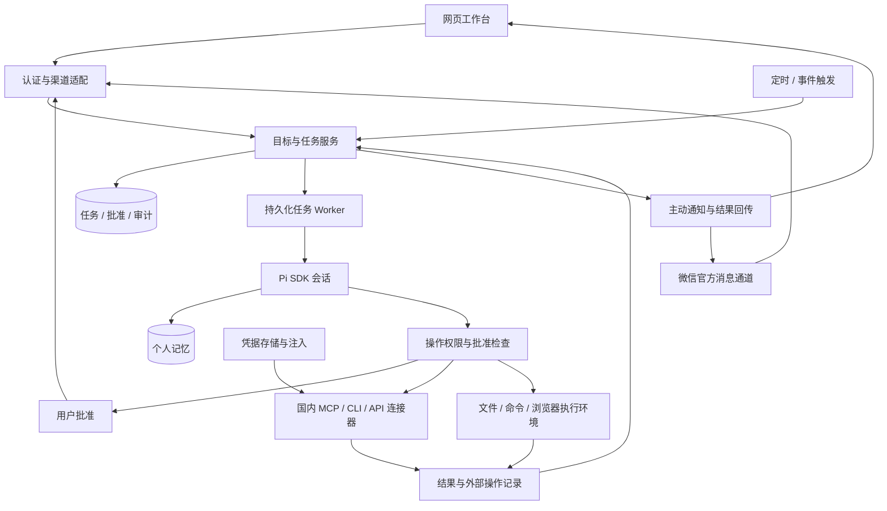

# Muse 产品研究与 Pi 项目方案

核查日期：2026-10-02。用户目标是在独立 VPS 上，以 Pi 为执行核心，开发功能类似 Meta Muse、全面接入国内生态的个人 Agent。

## 研究结论

Muse 的关键产品机制是持续运行的个人环境、目标推进、后台任务、记忆、连接器、主动联系，以及可控制的代理操作。国内已有足够的第一方 MCP、Skills、CLI 和 API 支撑这一方向；完整清单见 [国内开放生态](domestic-ecosystem.md)。

Pi 提供模型调用、工具执行、会话和扩展机制；本项目需要补上目标与任务系统、调度、个人记忆、渠道适配、授权审批和审计。下面的技术方案是本项目的设计建议，不是已经证实的 Muse 内部实现。

本轮仅研究公开官方资料，没有登录 Muse、审计其源码或实测网站任务成功率。

浏览器专项已补充 [控制机制与 Pi/VPS 选型报告](browser-control-research.md)。本轮取得的一手正文没有披露 Muse 使用 CDP、Playwright、DOM/AX 或截图控制的具体方式；报告中的结构化浏览器路线是本项目的工程建议。

## Muse 已公开的能力

| 产品机制 | 官方说明 | 本项目的对应能力 |
| --- | --- | --- |
| 专属云端计算机 | Secure VM 存放 Agent、个人数据和连接凭据，其他用户的 Agent 不能访问 | 单用户 VPS 持续运行，文件和任务工作区持久化，执行进程按权限隔离 |
| 浏览器操作 | 可打开浏览器、填写表格和代表用户处理事务，示例涉及旅行、邮件等 | 受控浏览器工具，保存必要结果；登录、验证码和站点限制分别处理 |
| 长期目标 | 为目标制定个性化计划、协调时间与资源并推进 | 目标与子任务、触发条件、进度、暂停和取消 |
| 后台工作 | 关闭 App 后仍继续执行，需要批准或发生变化时联系用户 | 常驻任务 worker，持久化状态，向消息渠道回传结果 |
| 记忆和主动建议 | 记住用户只说过一次的细节，也可以按要求忘记；主动提出建议 | 有来源的个人记忆、删除与纠错、基于目标和事件触发的建议 |
| 多入口 | Muse App、WhatsApp、iOS、Android 和 muse.ai | 网页工作台和国内消息渠道，共享同一用户与任务状态 |
| 服务连接 | 用户选择连接 App 和授予的权限，例如邮件只读或允许发送，可撤销 | 国内连接器、授权范围、凭据刷新、断开和重新授权 |
| 自定义连接器 | 9 月 29 日文章明确提到 custom connectors | 支持新增 MCP、Skill/CLI 和 API 适配器；不能据此断言 Muse 全部采用 MCP |
| 敏感操作与审计 | 发邮件、购买等操作前询问用户，展示已执行与计划执行的轨迹 | 参数明确的批准请求、执行结果、操作日志和凭证 |
| Sentinel | 与 Muse 同 VM、在系统层隔离；互联网操作须经其批准，必要时询问用户 | 独立于执行模型的权限检查与执行代理，可加模型辅助审查；不能只靠提示词限制 |
| 凭据保护 | 安全存储中的密码和支付方式可被使用但不向 Muse 展示 | 尽量由连接器或凭据代理注入凭据，日志脱敏；工具返回值不包含密钥 |

上述是官方产品说明，并不代表本轮已验证其安全机制。资料没有公开目标调度算法、虚拟化技术、具体计算资源、故障恢复指标或浏览器兼容性。

### 时间、可用性与尚未上线的承诺

- 2026-09-08：个人 Muse 发布，公告写明在美国开始上线，模型名称为 Muse Spark；大部分需求免费，另有订阅方案，三篇资料不足以确定完整价格和配额。
- 2026-09-24：Connect 综述介绍更多连接器和语音等能力；AI 眼镜、独立邮件地址及 Expedia 等部分能力使用未来时，不能全部归为已上线。
- 2026-09-29：小企业文章明确个人 Muse 已在美国和加拿大可用，并说明自定义连接器等能力。
- Confidential VM 在 9 月 8 日公告中为“今年稍后”推出的计划，宣称用户持有加密密钥、Meta 也无法访问；不能把它当作当前 Secure VM 已具备的属性。
- 官方说明可退出训练、对话和 VM 数据不提供给广告系统；这不等于当前 VM 的所有数据对运营方都不可访问。

这三篇资料未证明中国大陆可用，也未给出自行部署方法、开源授权、VPS CPU/RAM 要求或 Pi 兼容方案。普通 VPS 加容器也不自动等价于 Sentinel 或 Confidential VM。

## Pi 的职责与边界

基准为 [Pi v1.0.0](https://github.com/earendil-works/pi/releases/tag/v1.0.0)，Node.js >=22.19.0。

| 组件 | 本项目用途 | 仍需实现的部分 |
| --- | --- | --- |
| `pi-ai` | 多供应商模型访问，包括官方已列出的多家国内供应商 | 模型选择、费用统计、业务预算和供应商故障处理 |
| `pi-agent-core` | 执行循环、工具调用、事件、steering 等底层控制 | 渠道、任务生命周期和持久化策略 |
| `pi-coding-agent` SDK | 首版嵌入入口，复用会话、上下文压缩、重试、资源加载与扩展 | 用户工作台、跨会话任务、记忆和授权策略 |
| MCP / Skills / CLI / API | 接入国内软件的执行能力 | 权限、Token 生命周期、配额、业务副作用和结果一致性 |

SDK 默认会话持久化有助于恢复对话上下文，但不代表任意中断的外部操作会自动可靠续跑。实验性 [pi-durable](https://github.com/earendil-works/pi/blob/v1.0.0/packages/durable/README.md) 提供检查点、恢复等机制；其 API 不是 coding-agent SDK 的配置开关，采用前应单独评估。

Pi 的模型重试也不能替代业务幂等控制。订单、消息发送和文件写入都要记录操作结果；超时后先查询是否成功，不能直接重复执行。

## 建议的单 VPS 架构

先按一个用户设计，以 Node.js/TypeScript 为主，任务和审批使用持久化数据库，成果保存在持久化文件目录。首版可采用 SQLite 和单个 worker；遇到实际并发或跨机需求再增加基础设施。

图中的检查必须由执行层落实。只包装 HTTP 工具而仍允许 unrestricted shell 或浏览器自由出网，会留下绕过路径；实际隔离需覆盖所有执行通道。

### 任务和目标

建议把目标、任务、执行尝试、外部操作、批准和成果分别记录。任务至少区分 `queued`、`running`、`waiting_approval`、`waiting_external`、`succeeded`、`failed` 和 `cancelled`；目标可以关联多次任务和触发条件。

worker 应记录检查点、超时、取消与重试策略。进程重启后恢复任务状态，对不确定是否已执行的外部操作先查询确认；用户关闭浏览器不会影响后台执行。通知也要保存发送状态，避免恢复时重复推送。

### 个人记忆

对话记录、待办、目标和用户记忆有不同生命周期。记忆记录内容、来源、更新时间和授权范围，支持用户查看、纠错与删除。ima 等外部知识库可以作为检索来源，项目自身的目标和个人偏好仍需独立维护。

主动行为以用户设置的目标、时间或事件为触发条件，设置调用预算和通知频率。消费类动作继续遵循业务授权流程，不能因目标已获准就推断所有后续扣款也获准。

### 连接器和批准

连接器记录官方来源、协议、授权方式、可用功能、读写范围、费用与通知限制。国内软件可以先复用第一方资产，但 OpenClaw 专属工具和插件需适配 Pi，Skill 本身也不会突破平台权限。

批准绑定具体动作、对象、金额和参数，并有有效期；参数变化后重新生成批准请求。工具执行前检查批准状态，执行后记录回执。凭据由可信连接器读取或注入，避免把支付密钥等直接放入模型上下文。

国内账号上的真实操作范围见生态清单。尤其应区分查询、跳转、待支付订单和已支付订单，避免把未完成的消费任务标记成功。

### 浏览器执行环境

浏览器底座选定 Browser Use Pi 的 TypeScript 执行层：Pi v1.0.0 统一规划，适配其持久代码执行、CDP 和 AX/DOM，VPS Chromium 与 profile 常驻，以 Playwright 为可靠性基线。选择依据是同技术栈、方便源码改造和自托管能力；Pi 版本兼容、国内页面效果与实际耗时仍需验证。直接执行的取消、结果校验与接管互斥由我们的外层实现。

工作台显示并接管同一个浏览器 session；接管时暂停 Agent 输入，交回后重新观察。登录目录、Pi 会话和任务数据库分别持久化，重启后先核对已执行结果。常规网页优先 DOM/AX，视觉按需补充；手机 App 和小程序另按开放能力处理。版本差异、接入方式与验收样本见浏览器专项报告。

## 建议的实现顺序

| 阶段 | 实现内容 | 关键验收 |
| --- | --- | --- |
| 1：完整任务流程 | 网页工作台、Pi SDK、持久化任务、一个国内消息渠道、一个知识平台、地图和检索 | 手机提交需求，后台处理，返回带来源的成果；关闭网页后继续执行，重启后状态可恢复 |
| 2：持续个人助手 | 长期目标、记忆管理、定时与事件触发、审批、取消、预算和审计 | 按目标继续推进，需要批准时等待；暂停后停止触发；用户删除记忆后不再用于后续上下文 |
| 3：生活执行 | 携程查询、瑞幸自提和滴滴沙箱，再启用符合账号条件的生产能力 | 准入及供给已核验；金额和对象展示准确，确认后执行；超时不重复下单，订单与支付状态可查询 |

第一阶段已选微信作为消息入口，采用官方公开协议开发 Pi 渠道适配器，详见 [微信接入方案](weixin-channel.md)。其他连接器从“飞书/腾讯文档/ima 中实际使用的平台 + 博查或百度搜索 + 高德或百度地图”选择，具体以用户账号获权和联调结果为依据。微信后台通知须单独验证；发送不可用时，成果和待批准事项保存在网页工作台，用户可通过微信查询。

已完成产品与生态调研，并将官方开发资产保存到 [本地资源库](../resources/ecosystem/README.md)。美团酒旅当前公开包缺少可用外网授权依赖，仅保留参考。尚未安装项目应用依赖、配置真实凭据或实现应用；下一阶段先验证少量连接器和完整任务流程，再逐步增加覆盖面。

## 官方依据

1. [Introducing Muse: Personal AI Agent，2026-09-08](https://about.fb.com/news/2026/09/introducing-muse-personal-ai-agent/)
2. [The Biggest News From Connect 2026，2026-09-24](https://about.fb.com/news/2026/09/the-biggest-news-from-connect-2026/)
3. [Muse for Small Business，2026-09-29](https://about.fb.com/news/2026/09/introducing-muse-small-business/)
4. [Pi SDK，固定 v1.0.0](https://github.com/earendil-works/pi/blob/v1.0.0/packages/coding-agent/docs/sdk.md)
5. [Pi MCP](https://github.com/earendil-works/pi/blob/v1.0.0/packages/coding-agent/docs/mcp.md)、[Skills](https://github.com/earendil-works/pi/blob/v1.0.0/packages/coding-agent/docs/skills.md)、[Security](https://github.com/earendil-works/pi/blob/v1.0.0/packages/coding-agent/docs/security.md)
6. [国内开放生态接入清单及逐项来源](domestic-ecosystem.md)
