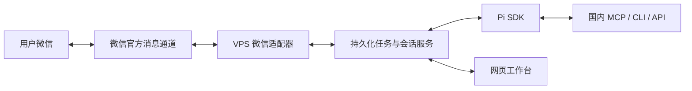

# 微信渠道接入方案

设计核查日期：2026-10-02；实现状态核对：2026-10-04。首版消息入口采用微信，执行核心为 Pi SDK，部署在独立 VPS。独立协议适配器已实现二维码/验证码登录、长轮询、身份绑定、消息去重、事务游标与任务/审批通知；协议测试已通过，本人扫码与真实消息联调仍待验收。本文保留设计依据与账号验收边界，当前实现见 [`src/server/channels/weixin.ts`](../src/server/channels/weixin.ts)。

证据基准为官方仓库提交 [24de5c9](https://github.com/Tencent/openclaw-weixin/tree/24de5c9eb0dd5e595d7e2d090ed8a3f82870d42c)，插件版本 `2.4.9`。后续实现固定版本，并在升级时复核协议变化。

## 官方能力与接入方式

腾讯的 [OpenClaw Weixin Channel](https://github.com/Tencent/openclaw-weixin) 是官方开源消息渠道插件，包名为 `@tencent-weixin/openclaw-weixin`。README 列出扫码登录、多账号、文字、图片、语音、文件、视频、长轮询和输入状态。

插件依赖 OpenClaw Gateway，不能直接作为 Pi 扩展加载。仓库同时提供 [微信后端协议](https://github.com/Tencent/openclaw-weixin/blob/main/docs/protocol_zh_CN.md) 和客户端源码，可以据此开发独立渠道适配器。协议文档明确基于当前客户端实现，并非完整服务端契约；自写适配器的实际可用范围要通过账号联调验证。

本项目优先采用以下路线：

适配器负责平台协议、授权、消息和附件；任务服务负责调度、批准和结果；Pi 负责模型与工具执行。微信接入不需要把项目的执行核心改成 OpenClaw。

保留 OpenClaw Gateway 和官方插件也是可选路线，但需要验证它与自定义 Pi 后端的转发接口，并协调会话、任务和批准状态。首版不引入这套额外宿主。

## 首版开发内容

按一个账号、一个用户设计，先完成文字消息，再加入媒体。

| 环节 | 实现要求 | 官方依据 |
| --- | --- | --- |
| 登录 | 获取二维码，由用户在微信确认；处理验证码、二维码过期和重定向；保存 Bot 凭据、账号与扫码用户标识，使用登录返回的 API 地址 | `get_bot_qrcode`、`get_qrcode_status` |
| 收消息 | VPS 通过 HTTPS 长轮询收取消息；保存非空更新游标；按账号和服务端消息标识去重 | `getupdates` |
| 身份与会话 | 只允许绑定的扫码用户提交任务；按渠道、Bot 账号和对端用户映射 Pi 会话，保存最新回复上下文及任务对应的入站上下文 | 登录的 `ilink_user_id`，入站的 `from_user_id`、`context_token` |
| 回复 | 将 Pi 回复或任务结果发送给对应用户，携带收到的 `context_token`；为每次出站请求保存 `client_id` 和发送状态 | `sendmessage` |
| 用户操作 | 通过文字提交任务、查询状态、取消和回答具体批准请求；批准绑定动作与参数 | 本项目任务服务实现 |
| 恢复与故障 | 消息和待处理任务持久化后推进游标；处理断网、HTTP/业务错误、凭据失效和重连，避免重复创建任务 | 官方轮询实现与本项目持久化设计 |

长轮询由 VPS 主动连接微信服务；这一路消息接收不依赖公网入站 webhook。网页工作台的域名、TLS 和访问认证另行配置。

协议中 `ret` 或 `errcode` 为 `-14` 时，当前官方插件暂停该账号一小时。适配器需要区分此类业务状态与普通网络错误，不能持续立即重试。

公开协议没有给出 Bot token 固定有效期或刷新接口，暂停一小时也不保证凭据恢复。失效时应标记需要重新授权。Bot 凭据和回复上下文在 VPS 独立持久化，限制文件访问权限并避免进入模型上下文或日志；`context_token` 不作为 Pi 会话 ID，落盘不代表它永久有效。

同一会话的 Pi 执行要协调排队、追加指令与取消；长任务由后台 worker 执行，消息接收循环不等待整个任务完成。发送超时可能已经送达，不能假设重复使用 `client_id` 就有服务端幂等保证。

## 媒体与通知边界

官方提供媒体传输流程，但它不只是向 `sendmessage` 填文件路径：图片和文件需要处理 CDN 上传/下载、AES 加解密和消息引用。语音字段可能包含转写文本，不能假定每条语音都有转写或所有编码均可直接解码。首版文字联调通过后，再验证图片与文件，随后评估语音和视频。

后台任务可以在 VPS 持续执行，但能否在任意时间发微信通知是另一个问题：

- 回复应携带入站 `context_token`，适配器持久化每个会话的最新值。
- 官方公开协议没有明确保证通知有效窗口、次数或无 `context_token` 时发送成功。
- 官方发送实现缺少上下文时会警告并继续尝试，这不能证明服务端接受任意主动推送。
- `notifyStart` / `notifyStop` 是渠道启动和停止通知，不是任意任务结果的推送接口。
- 需要测试延时回复、进程重启后的回复、长期无新消息后的通知和凭据失效，记录实际可用条件。

结果发送失败时，保留成果和通知状态，在网页工作台显示，并允许用户从微信查询。不能因为微信发送失败而重新执行任务或消费操作。

接入范围是官方 Agent 消息通道，当前插件声明 `chatTypes: ["direct"]`。不据此承诺读取全部私人微信历史、好友列表、朋友圈或任意群聊。首次扫码授权和需要重新授权时，由用户完成微信侧确认。

## 验收顺序

1. 扫码后，微信发送文字，VPS 收到并由 Pi 回复；核实账号与对端映射，其他发送者不能创建或操作任务。
2. 相同消息被重复交付时只创建一个任务；断网恢复、重启后游标与会话可恢复。
3. 提交耗时任务后，仍可查询、取消或批准；任务完成状态与通知发送状态分别保存。
4. 验证不同延迟和重启后的结果回传；确定微信通知适用条件与失败时的查询流程。
5. 加入图片接收与文件成果回传，验证媒体大小、格式、加密和错误处理。

完成这些验收后，再接入搜索、知识平台、地图及生活服务工具。

## 第一方来源

- [官方 README](https://github.com/Tencent/openclaw-weixin/blob/24de5c9eb0dd5e595d7e2d090ed8a3f82870d42c/README.md)
- [协议文档](https://github.com/Tencent/openclaw-weixin/blob/24de5c9eb0dd5e595d7e2d090ed8a3f82870d42c/docs/protocol_zh_CN.md)
- [扫码登录](https://github.com/Tencent/openclaw-weixin/blob/24de5c9eb0dd5e595d7e2d090ed8a3f82870d42c/src/auth/login-qr.ts)
- [消息发送](https://github.com/Tencent/openclaw-weixin/blob/24de5c9eb0dd5e595d7e2d090ed8a3f82870d42c/src/messaging/send.ts)
- [长轮询与重试](https://github.com/Tencent/openclaw-weixin/blob/24de5c9eb0dd5e595d7e2d090ed8a3f82870d42c/src/monitor/monitor.ts)
- [媒体处理](https://github.com/Tencent/openclaw-weixin/blob/24de5c9eb0dd5e595d7e2d090ed8a3f82870d42c/src/media/media-download.ts)
